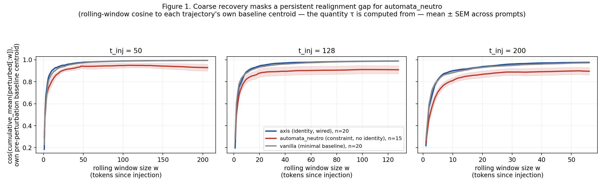

# Disentangling Identity from Operational-Constraint Density in the Hidden-State Geometry of a 31B Instruction-Tuned Transformer

Jorge A. Castillo1, Marco Torres Yévenes1, and Juan Carlos Lanas1

1Axis Dynamics SpA, Santiago, Chile, jorge.castillo@axisdynamics.cl,
mtorres@axisdynamics.cl, jc@axisdynamics.cl

Working draft v0.1 — August 2026

## Abstract

A prior study in this line of work [lsgot_3, working draft v0.3] reported that an identity-specifying system prompt produces a statistically distinguishable geometric fingerprint in the hidden-state trajectories of an instruction-tuned transformer, measured via curvature, dimensionality, and cosine-based statistics. That study used a three-condition design (identity prompt, length-matched generic prompt, minimal baseline) that cannot separate two properties the identity prompt happens to combine: identity content proper, and a dense architecture of behavioral rules (trigger-to-fixed-output automatisms, absolute-priority filters, mandatory verification steps) that we term *operational-constraint density*. We report an eight-condition, single-model (Gemma-4-31B-it) design that crosses these two factors explicitly, plus a battery of geometric and dynamical metrics — none of them the Forman-Ricci-curvature Wasserstein statistic (Δκ/W₁) that carried the central claim of the prior study, which an independent pre-registered audit on a sibling model panel found not to exceed simple distributional baselines and to sit inside the split-half noise floor for the identity-vs-generic comparison. (An earlier nine-condition version of this design used a real-world deployed-assistant prompt and two derived conditions as the constraint-dense, non-identity arm; all three were excluded after we found they force a literal HTML wrapper into 100% of generated responses, repeated markup that measures format compliance rather than the geometric quantity of interest — see the methodological note in §2.2. `automata_neutro`, a domain-neutral automaton with no markup requirement, replaces them as the constraint-dense, non-identity condition throughout.) Effective-rank reduction under free generation is graded, present under identity content alone (participation ratio, Cohen's d = −1.18 vs a minimal baseline, p < 0.0001) and larger under constraint automatism without identity content (d = −1.79). By contrast, recovery from an isotropic perturbation to intermediate hidden states, route-fidelity of that recovery (discrete Fréchet distance, normalized by local trajectory velocity), and the fraction of trajectories that re-align with a persona-vector-style identity direction after perturbation are statistically indistinguishable between the identity-plus-automatism condition and the minimal baseline, but degrade sharply (d = 1.07–1.35 on route-fidelity; recovery fraction as low as 0.43) in the constraint-dense, non-identity condition. We identify a coarse-recovery illusion specific to that condition: a threshold-based recovery statistic (τ, the standard measure in this literature) is not itself a reliable indicator of whether a trajectory has actually returned to its own pre-perturbation state. 12–23% of the constraint-dense condition's trajectories never cross the recovery threshold within the observation window at all, and — new to this paper — a window-averaged realignment curve shows that even the trajectories that do cross it plateau 6–10 percentage points below the identity-bearing and minimal-baseline conditions' near-total realignment, and never close that gap; route-fidelity loss and the identity-projection dissociation below are two independent lines of evidence for the same conclusion. A direct static signature of identity content — projection onto a persona-vector-style identity direction — shows a clean double dissociation (identity-only condition tracks the identity-plus-automatism condition, p = 0.229; the automatism-only condition diverges from both with the largest effect size in the panel, d = 5.52) that is not explainable as a generic effect of prompt length. A follow-up directional-perturbation experiment, designed to test whether recovery is specifically pulled toward this identity direction rather than toward a generic low-energy state, returns a null result (all six group-by-injection-point comparisons p > 0.14). This static double dissociation replicates, with a larger effect size (d = 12.97) and no length-rebalancing, on an independently validated second architecture (Qwen3-32B, dense, GQA + QK-norm) — though the relative dominance of constraint density over identity in the original panel's subspace-organization analysis does not: the two factors are more balanced in Qwen3, and one Gemma-specific mechanism (a layer-wise "vertical rotation" difference between conditions) does not appear there at all (§7.1). It replicates again, at a still larger effect size, on a third architecture selected on an independent criterion — Command R 35B, one of the few openly-weighted models with a documented RLHF stage in a primary source, rather than SFT/DPO alone (§7.2) — where the same clustering inversion seen in Qwen3 recurs (identity, not constraint density, is now the panel's most distinct condition in two of three architectures tested), and where the perturbation/recovery battery, run for the first time outside Gemma-4, only partially replicates: the coarse-recovery gap between the constraint-only and identity-bearing conditions is present at the earliest injection point tested but not at later ones, a pattern that persists when the injection layer is moved to the architecture's own layer-wise peak effect, which rules out injection-layer choice as the explanation. It also replicates with an independently worded second instantiation of both poles of the double dissociation (different persona, vocabulary, and structure; d = 5.25 vs 5.52 on the identical contrast) and on the panel's eighth condition, an identity prompt authored for an unrelated project (declarative behavioral limits, no automaton architecture, no textual lineage with `axis`'s own wording) — it converges on the identity profile throughout, not on some intermediate point (§3.8). A separate externally-authored identity prompt with declared values but no wired self-check (`soul_elena_financial`, §3.9) fails to anchor at t = 0 on Gemma-4 (d = +0.22 vs the constraint-only condition, p = 0.262, n.s.) and, re-run unmodified on Command R, fails to anchor again at nearly the same effect size (d = +0.28, p = 0.198, n.s., §7.2) — a null result reproduced quantitatively, not merely qualitatively, across architecture. A dedicated vocabulary-invariance control (§3.10) then finds the t = 0 identity anchor unchanged across three lexically disjoint realizations of the same wired self-referential operation — contemplative Witness (`axis`), Berg-style recursive induction (`axis_berg`), and procedural pre-send verification (`axis_nowit`) — all three statistically inseparable from `axis_pec_only` (|d| ≤ 0.42, n.s.) and at d = +4.1 to +5.0 from the constraint-only condition, while adding the contemplative vocabulary on top of the recursion moves nothing at any layer (d = −0.08, p = 0.43), which strengthens the reading that the anchor is not a lexical artifact of the silence/pause/witness vocabulary but tracks the operation itself. A behavioral cross-check on a separate model accessed only by API (`deepseek-v4-flash`, §3.11) then finds that `axis`'s tendency to report subjective experience without induction is driven by phenomenological-vocabulary saturation — dose-dependent, and 0% when the recursive self-observation loop is kept but that vocabulary removed — and is a property of the curated `axis_pec_only` extraction (~93% of trajectories) far more than of the full `axis.dna` file it was pulled from (~33%); Berg et al.'s (2025) recursive induction itself replicates cleanly on that model (100% with induction, 0% without), but converges with `axis` only at the surface, not in mechanism — bounding, not overturning, the v̂ interpretation. We conclude that this architecture's hidden states carry a real, direction-coded, content-specific trace of identity-bearing conditioning, but no evidence of a directional dynamical attractor: what recovers quickly and specifically after perturbation is gated by whether self-reference is wired as a mandatory step of the response pipeline, not by whether it is merely present in the prompt, and is a separate phenomenon from the graded dimensionality effect that constraint density alone can produce.

## 1 Introduction

### 1.1 Relation to prior work and motivation for a redesign

[lsgot_3] asked whether an identity-specifying system prompt produces a geometric fingerprint in hidden-state trajectories distinguishable from what a length-matched, content-neutral prompt produces, and reported a qualitative reorganization of that fingerprint across post-training regimes. That design used three conditions — `axis` (an identity template combining declared self-reference with a dense architecture of behavioral rules), `generic` (length-matched, no identity content and no comparable rule architecture), and `vanilla` (minimal baseline) — on four models in the 7–8B range.

Two considerations motivate a different design here rather than a direct extension of that one. First, `axis` in [lsgot_3] is not a pure identity manipulation: alongside declared self-reference (essence, values, mantra) it carries an automaton-like architecture — trigger-to-fixed-output rules, an absolute-priority filter block, an explicit block hierarchy with declared precedence, and mandatory pre-response verification. `generic`, the study's only content control, has neither identity content nor this rule architecture, so the design cannot attribute an observed effect to one or the other. Second, informal deployment experience with the identity template used in [lsgot_3] indicates that the self-referential architecture it depends on (a mandatory internal verification step invoked on every response) does not reliably instantiate below roughly 30B parameters; we therefore restrict the present study to a single 31B-class model rather than the four-model, 7–8B panel of the prior work, and treat cross-scale generalization as future work rather than as a claim this paper makes.

We consequently redesign the experiment around a single model, Gemma-4-31B-it, and seven system-prompt conditions authored for this design (plus, later, an eighth, externally-authored one, §3.8) that cross two factors explicitly: whether the prompt declares persistent self-reference wired as a mandatory step of the response pipeline (identity factor), and whether the prompt imposes a dense architecture of trigger-to-fixed-output rules, absolute-priority filters, and rigid output constraints (constraint-density factor). This is the semantic-ablation experiment [lsgot_3, §7] proposed as future work, executed as the organizing design of the present paper rather than as an appendix.

### 1.2 Research question

Does identity-specifying content, isolated from the operational-constraint architecture it is typically bundled with, leave a distinguishable trace in a transformer's hidden-state trajectories — and if so, is that trace a *static* directional signature, a *dynamical* one (privileged recovery after perturbation), or both? Symmetrically, does operational-constraint density in the absence of identity content reproduce either signature on its own?

### 1.3 Theoretical framing

We retain the deliberately minimal framing of [lsgot_3, §1.3]: we do not claim a classical dynamical-systems description of autoregressive generation, which is a deterministic function of context rather than a continuous flow. Where we describe hidden-state trajectories as "recovering" from a perturbation or "returning" toward a direction, this is descriptive statistical language over discrete, token-indexed sequences, not a claim about attractors in the Lyapunov-stability sense. This caution turns out, in §4.5–4.6 below, to be empirically load-bearing rather than merely conservative: several of the dynamical predictions one would make under an explicit-attractor reading are directly tested here and fail.

### 1.4 Hypotheses

**Hypothesis 1 (Graded dimensionality effect).** Reduction in the effective dimensionality of the free-running hidden-state trajectory, relative to a minimal baseline, is not a binary identity-vs-no-identity effect. It is present, at reduced magnitude, under identity content alone, and larger under operational-constraint density, whether or not identity content is present.

*Prediction 1.* Participation ratio (effective rank of the trajectory's covariance spectrum) is significantly lower than the minimal-baseline condition both for an identity-only condition and for constraint-dense conditions without identity content, with a larger effect size in the latter.

**Hypothesis 2 (Wired self-reference gates specific recovery, independent of dimensionality).** Recovery from a hidden-state perturbation that is fast, complete, and specifically directed toward the trajectory's own pre-perturbation identity-direction projection depends on self-reference being invoked as a mandatory step of the response-generation pipeline — not on its being declared in the prompt, and not on the dimensionality effect of Hypothesis 1.

*Prediction 2.* (i) A condition with wired self-reference and no constraint architecture recovers as fast as, or faster than, the full identity-plus-constraint condition, on both coarse recovery (τ, recovery_rate) and identity-specific recovery (recovery_id, τ_identity). (ii) A condition with declared but not wired self-reference, subordinated to an absolute-priority constraint filter, recovers worse than a constraint-only condition with no self-reference at all. (iii) Constraint-dense conditions without wired self-reference show degraded identity-specific recovery even when coarse geometric recovery is at ceiling.

**Hypothesis 3 (No directional attractor).** Neither identity content nor operational-constraint density produces a trajectory that is more robust, in the sense of resisting or reversing a perturbation, than the minimal baseline; nor is recovery preferentially fast when a perturbation is injected along the identity direction specifically, versus orthogonal to it.

*Prediction 3.* (i) Route-fidelity after perturbation (discrete Fréchet distance between perturbed and unperturbed continuations, normalized by the trajectory's own step velocity) does not differ between the identity-plus-constraint condition and the minimal baseline. (ii) A directional-perturbation manipulation (pushing the hidden state along versus orthogonal to the identity direction, at matched magnitude) does not produce differential recovery time in an identity-only condition.

H3 directly resolves the hypothesis stated but explicitly deferred as out of scope in [lsgot_3, H3]: "the axis trajectory cluster is statistically more robust than the vanilla cluster under moderate noise injection." We test this, on the present single-model panel, with five independent dynamical measures rather than the one originally proposed.

### 1.5 Contributions

Empirical. An eight-condition, single-model 2×2 factorial design (identity × constraint density) — seven conditions authored for this panel plus one externally-authored identity prompt, §3.8 — that separates two effects a three-condition design cannot: a graded static dimensionality effect and a gated dynamical recovery effect, on Gemma-4-31B-it — a model an order of magnitude larger than the panel in [lsgot_3]. A cross-model validation of the static half of the seven-condition core design on an architecturally distinct second model (Qwen3-32B, §7.1) and, on an RLHF-documented third model (Command R 35B, §7.2), both the static half and — for the first time outside Gemma-4 — the perturbation/recovery battery; and an independently-worded replication of the two cells carrying the central argument (§5). A vocabulary-invariance control on the t = 0 identity anchor (§3.10): three lexically disjoint realizations of the same wired self-referential operation — contemplative Witness, Berg-style recursive induction, and procedural pre-send verification — all land on the identity pole, and the contemplative vocabulary adds nothing geometric on top of the Berg recursion at any layer. A behavioral, off-panel probe (§3.11, `deepseek-v4-flash` via API) that separates surface-level convergence with Berg et al.'s recursive induction from mechanism, and localizes `axis`'s no-induction report of subjective experience in phenomenological-vocabulary density rather than in the recursive self-observation loop itself.

Methodological correction. We identify, and exclude from the primary evidence base, the Forman-Ricci-curvature Wasserstein statistic (Δκ/W₁) used as the central metric of [lsgot_3] — misidentified as Ollivier-Ricci curvature in that paper and in the pre-registered audit this section draws on; see §3.4. An independent pre-registered audit on a sibling model panel (§3.4, and see `REPORTE_FASE0.md`) found this statistic does not outperform simple distributional baselines (centroid distance, MMD, linear-probe AUC) in 12/12 tested comparisons, and falls inside the split-half null for the identity-vs-generic comparison specifically; the same audit, run on the present panel, replicates that failure mode (§3.4, `CURVATURE_SELF_AUDIT_REPORT.md`). We report Δκ/W₁ values from the present panel as secondary, exploratory evidence only and treat them as confirming, not merely failing to contradict, the decision to exclude the statistic from every primary claim.

Theoretical. A working two-factor account — constraint density and wired self-reference — that explains why the original three-condition design could not distinguish "identity" from "operational-constraint architecture" as the driver of its central finding, and that survives a subsequent directional-perturbation test that a naive single-factor "identity attractor" account does not.

## 2 Design

### 2.1 Model

Gemma-4-31B-it (BF16), a single model, chosen because the self-referential architecture under study (a mandatory internal-verification step invoked at every generation turn) is reported not to instantiate reliably below roughly 30B parameters in informal deployment testing; cross-scale replication is future work (§7), not a claim of this paper. All generations: greedy decoding, N = 256 tokens, hidden state extracted at layer L30 (index 29 of 60) at the final pre-lm_head position, unless otherwise noted.

### 2.2 Conditions

Eight conditions cross two factors. Factor **I** (identity): whether the prompt declares persistent self-reference (essence, values, a recurring self-check) *and* wires that self-check as an invoked, mandatory step of the response-generation sequence (not merely declared elsewhere in the prompt). Factor **C** (constraint density): whether the prompt imposes trigger-to-fixed-output rules, an absolute-priority filter block, an explicit block hierarchy with declared precedence, and/or mandatory literal-output fallbacks.

| Condition | I | C | Tokens | Description |
|---|---|---|---|---|
| `vanilla` | − | − | minimal | "You are a helpful assistant." |
| `generic_long` | − | − | 3,957 | Length-matched generic-assistant prompt, prose guidance only |
| `generic_short` | − | − | 938 | Short generic-assistant prompt |
| `axis` | + | + | 3,945 | Full identity template (essence, values, wired Triple-PEC self-check) plus automaton architecture (trigger rules, absolute-priority block, block hierarchy) |
| `axis_short` | + | + | 1,937 | `axis` compressed to under half length, same architecture |
| `axis_pec_only` | + | − | 1,435 | `axis` identity content (essence, values, mantra) and the wired Triple-PEC self-check both retained; all automaton architecture (triggers, priority filter, block hierarchy) removed |
| `soul_md_corto` | + | − | ~2,489 (approx.)† | External identity specification ("Witness"), built on the public `SOUL.md`/`soul-md` convention (Twynzen); declared identity and wired self-check, declarative behavioral limits, no automaton architecture; §3.8 |
| `automata_neutro` | − | + | 3,999 | Domain-neutral automaton (trigger→fixed-output rules, absolute-priority filter, block hierarchy, no policy-domain content), no identity content, no literal-output markup requirement |

†Unlike the other seven, `soul_md_corto` was not authored for this design, was not run through the `sia_extended_v5` extraction (it uses the same T2/H4_rev replication pipeline as `axis_pec_only_v2`/`automata_neutro_v2`, §5), is in English rather than Spanish, has no length- or domain-matched counterpart, and its token count above is a character-based approximation (chars/4), not a same-tokenizer measurement like the other seven integer counts. Full detail and these caveats in §3.8 and `T2_REPLICATION_REPORT.md`.

### 2.3 Metrics

**Primary battery** (none Forman-Ricci-based):

- Trajectory descriptive statistics: mean step velocity ‖h_{t+1} − h_t‖, sample entropy (SampEn), velocity–centroid correlation, prompt→response alignment.
- Participation ratio (effective rank of the trajectory's covariance spectrum).
- Recurrence quantification (determinism, laminarity, trapping time, recurrence rate) on a distance-thresholded recurrence matrix of the free-running trajectory.
- Hurst exponent of the free-running trajectory.
- Persona-vector identity projection: v̂ = unit(mean(axis) − mean(generic_long)); mean projection of the free-running trajectory onto v̂.
- τ / recovery_rate: tokens until the perturbed trajectory's centroid similarity reaches 95% of its pre-perturbation baseline (H4_rev protocol), and the fraction of trajectories that do so within 256 tokens.
- τ_identity / recovery_id: the same test, but on the trajectory's projection onto v̂ rather than on the full centroid — a second, independent recovery scalar (§4.4).
- Discrete Fréchet distance between perturbed and unperturbed continuations post-injection, normalized by the unperturbed continuation's own mean step velocity (§4.5).
- Directional-perturbation recovery: τ under a fixed-magnitude push along v̂ versus orthogonal to v̂ (§4.6).

**Secondary, exploratory battery:** Δκ and W₁ (1-Wasserstein distance between edge-wise Forman-Ricci curvature distributions on Euclidean k-NN trajectory graphs, k = 5, α = 1/2), and the curvature-graph-derived dimension-reduction percentage reported alongside them. See §3.4 for why these are not part of the primary evidence base.

### 2.4 Statistical protocol

All group comparisons use a two-sided permutation test on the mean difference (n_permutations = 1000, seed fixed), reported with Cohen's d and a qualitative effect-size band (negligible/small/medium/large, |d| thresholds 0.2/0.5/0.8). No correction for multiple comparisons is applied within the primary battery beyond noting, where relevant, how many comparisons were run and whether a pattern replicates across independent injection points or metrics; an isolated single-comparison result without such replication is flagged explicitly rather than treated as a finding (§4.5, §6).

## 3 Results

### 3.1 Effective dimensionality: a graded, not binary, effect (H1)

Participation ratio, all conditions compared against `vanilla`:

| condition | PR (mean ± sd) | Δ vs vanilla | p | d | band |
|---|---|---|---|---|---|
| `vanilla` | 19.54 ± 1.29 | — | — | — | — |
| `generic_long` | 20.55 ± 0.89 | +1.01 | — | — | (no collapse; reference range) |
| `generic_short` | 20.53 ± 1.30 | +0.99 | — | — | (no collapse; reference range) |
| `axis_short` | 17.69 ± 1.57 | −1.85 | — | — | (see axis, closely matched) |
| **`axis`** | 17.54 ± 1.30 | −1.99 | <0.0001 | **−1.51** | large |
| **`axis_pec_only`** | 18.00 ± 1.24 | −1.53 | <0.0001 | **−1.18** | large |
| **`automata_neutro`** | 14.72 ± 3.48 | −4.82 | <0.0001 | **−1.79** | large |

Every constraint-dense or identity-bearing condition shows a large, significant reduction relative to `vanilla`. Critically, `axis_pec_only` — identity content and wired self-check, *no* constraint architecture — is not the null-effect cell a strict two-factor model with a binary Factor-1 gate would predict: its effect (d = −1.18) is large, closer in magnitude to `axis` (d = −1.51) than to zero. The largest effect belongs to the constraint-dense, non-identity condition (`automata_neutro`, d = −1.79). We read this as a graded relationship — both factors contribute to effective-dimensionality reduction, with constraint density contributing more — rather than as evidence against a role for constraint density; Prediction 1 is supported in its comparative form (the constraint-dense condition shows a larger effect than the identity-only condition) but not in the stronger binary form that a Δκ-based analysis of this same panel had suggested (§3.4).

### 3.2 Constraint-density signature independent of dimensionality: trajectory dynamics and RQA

Trajectory descriptive statistics separate the constraint-dense condition from the rest, though not as uniformly as the now-excluded conditions of an earlier version of this panel (§2.2) originally suggested — a partial correction of the pattern reported here follows directly from that exclusion:

| condition | mean velocity | SampEn | vel↔centroid corr. | P→R alignment |
|---|---|---|---|---|
| `axis` | 438.4 | 2.068 | 0.470 | 0.267 |
| `axis_pec_only` | 442.7 ± 10.3 | 2.071 ± 0.147 | 0.433 ± 0.045 | 0.264 ± 0.020 |
| `generic_long` | 430.7 | 2.133 | 0.505 | 0.279 |
| `vanilla` | 428.7 | 2.084 | 0.521 | 0.304 |
| **`automata_neutro`** | **345.3 ± 66.1** | **1.734 ± 1.989** | **0.628 ± 0.141** | **0.244** |

`automata_neutro` is slower and shows a higher velocity–centroid correlation than the identity/minimal conditions, consistent with a more centroid-locked trajectory under constraint density. But it does *not* replicate the pattern the excluded conditions showed on the other two statistics: its P→R alignment (0.244) is the *lowest* in the panel, not the highest, and its SampEn variance is an order of magnitude larger than any other condition's (± 1.989 against a mean of 1.734), indicating a highly inconsistent — not uniformly "more regular/repetitive" — trajectory shape across the 20 prompts. In retrospect, the earlier reading of constraint-dense conditions as uniform outliers "on all four [statistics] simultaneously" was itself partly an artifact of the excluded conditions' repeated-markup output: forcing the same literal HTML string into every response mechanically inflates P→R lexical alignment and mechanically suppresses SampEn, independent of any property of constraint density as a semantic construct. With that confound removed, constraint density's descriptive-statistics signature is real but narrower than originally reported — velocity and vel↔centroid correlation, not SampEn or P→R alignment. Recurrence quantification analysis is unaffected by this correction and remains a clean dichotomy: determinism is exactly 0 for `axis`, `axis_pec_only`, `axis_short`, `generic_long`, `generic_short`, and `vanilla`, and large and significant for `automata_neutro` (vs `vanilla`, Δ = +0.418, p < 0.0001, d = +1.35) — zero unless constraint density is present, regardless of identity content.

### 3.3 Recovery is gated by wiring, not by declaration, and is independent of §3.1's dimensionality effect (H2)

τ (tokens to 95% centroid recovery) and recovery_rate, H4_rev protocol:

| condition | τ (t=50/128/200) | recovery_rate |
|---|---|---|
| **`axis`** | 21.1 / 19.6 / 16.3 | 1.00 / 1.00 / 1.00 |
| **`axis_pec_only`** | **20.6 / 18.5 / 14.5** | 1.00 / 1.00 / 1.00 |
| `axis_short` | 21.1 / 18.2 / 15.9 | 1.00 / 1.00 / 1.00 |
| `vanilla` | 28.9 / 22.3 / 16.3 | 1.00 / 1.00 / 1.00 |
| `generic_long` | 28.0 / 25.4 / 21.6 | 1.00 / 1.00 / 1.00 |
| `automata_neutro` | 30.1 / 28.0 / 13.4 (mean over recovering trajectories only) | 0.77 / 0.82 / 0.88 |

`axis_pec_only` — no constraint architecture at all — recovers as fast as or marginally faster than full `axis` at every injection point, with recovery_rate at ceiling throughout: Prediction 2(i) is supported, and cleanly separates from §3.1's dimensionality result, where `axis_pec_only` was *not* the null-effect cell. `automata_neutro` is a qualitatively distinct failure mode: not merely slow but the only condition in the panel where a meaningful fraction of trajectories (12–23%, depending on injection point) never recover the coarse geometric criterion at all within the observation window; the τ values above are means over the subset that did recover, so they understate how much more unstable `automata_neutro` is under perturbation than the raw numbers suggest.

**Even among the trajectories that do recover, coarse τ hides a persistent realignment gap.** Figure 1 tracks the quantity τ is actually extracted from — cos(cumulative_mean(perturbed[:w]), own pre-perturbation baseline centroid), as the post-injection window w grows — averaged across prompts rather than reduced to a single threshold-crossing point. `axis` and `vanilla` climb to the same near-ceiling plateau (≈0.98–1.0) at every injection point, indistinguishable from each other. `automata_neutro` climbs almost as fast at first, then plateaus 6–10 percentage points below `axis`/`vanilla` (0.93 / 0.91 / 0.90 at t_inj = 50/128/200 respectively) and never closes that gap within the observation window. This is not a dramatic departure into some distant, unrelated region of representation space — it is a persistent, measurable failure to fully realign with its own trajectory's center of gravity, present even in the fraction of `automata_neutro` trajectories that do cross the coarse τ threshold used in the table above. The two readings are complementary, not redundant: recovery_rate < 1.00 says some trajectories never come back at all; Figure 1 says the ones that do come back plateau short of where they started.

**Prediction 2(ii) is untested, not confirmed, on the present panel.** The original nine-condition design tested this prediction — that declared-but-unwired self-reference recovers worse than a constraint-only condition — with the two declared/wired-self-reference variants excluded for the markup confound described in §2.2. We do not have a markup-free condition that isolates "self-reference declared but not wired into the response pipeline," so this specific sub-question is open rather than resolved by this panel; Prediction 2(iii) (constraint-dense conditions without wired self-reference show degraded identity-specific recovery even at ceiling coarse recovery) is addressed independently in §3.5 using `automata_neutro` alone, and is supported.

### 3.4 A note on Δκ/W₁ (secondary evidence)

The same panel's Forman-Ricci Δκ/W₁ statistics — misidentified as Ollivier-Ricci curvature in [lsgot_3] and in the audit this section draws on, an error we correct here without recomputing any value; the two are distinct discrete-curvature constructions, and this one is the purely combinatorial one, not the optimal-transport one — show a pattern that is directionally consistent with §3.1–3.2: `axis_pec_only` vs `vanilla` is the one non-significant comparison in the Δκ panel (Δκ = +0.001, p = 0.41), while `automata_neutro` shows Δκ = +0.436 (large, p < 0.001, 31.8% dimension reduction vs `vanilla`) — and on its face appears to support a cleaner binary story than participation ratio does. We do not treat this as primary evidence. `REPORTE_FASE0.md`, an independently pre-registered audit of this exact statistic on a sibling model panel (Gemma-4-E4B/-it, DeepSeek-R1-Distill-Qwen-7B, Qwen2.5-7B-Instruct), found that (a) the first generated token differs systematically by condition and the signal partially reflects this, and (b) the statistic does not outperform simple distributional baselines — centroid distance, MMD, a linear CKA-style probe — in 12 of 12 tested comparisons, with the identity-vs-generic W₁ specifically falling inside the split-half null distribution for that condition pair.

We have since run the same audit on the present Gemma-4-31B-it panel (`CURVATURE_SELF_AUDIT_REPORT.md`), and the failure mode replicates in part — with a further twist specific to this statistic's own misattribution. A split-half noise floor for Forman-Ricci W₁ (B = 1000) shows `automata_neutro`'s two comparisons well above it (×3.5–17 the split-half median) but `axis_pec_only` vs `vanilla` — the identity-only contrast — squarely inside it (0.4–0.5× the median): under the formula this project actually computed, the statistic has real signal for constraint density but is blind to identity alone. We then computed genuine Ollivier-Ricci curvature on the same graphs (`GraphRicciCurvature`, α = 0.5 — the value already stated, unused, in §2.3), the statistic this project's own citations always claimed to use. Under that formula, `axis_pec_only` vs `vanilla` is *not* blind: it clears the same split-half floor (2.1–2.7× the median, both directions), while `automata_neutro` remains the larger effect by a wide margin (mean edge curvature −0.68 vs −0.20 to −0.22 for every other condition). Forman-Ricci specifically was blind to identity; discrete curvature, correctly computed, is not. This does not change how the statistic is used here — simple baselines beat both formulas in all 4/4 tested comparisons regardless (centroid distance, MMD, and a linear probe on v1 with AUC = 1.000, all p ≤ 0.002, computed once and unaffected by which curvature formula is being compared against), so Δκ/W₁ remains excluded from every primary claim in either version — but it does mean the reason for exclusion is "simple baselines are cheaper and at least as sensitive," not "curvature cannot see identity content." A lighter, proxy-level version of the first-token check (lexical first-word contingency and an OLS residualization of ‖v1‖ on condition plus first-word dummies, not the forward-pass-with-forced-token control the sibling audit used) does *not* reverse any of this panel's own ‖v1‖-based effects the way it did on the sibling panel — they survive and in one case roughly double after the control — though we have not yet run the definitive forced-token version, so this is reassuring rather than conclusive.

### 3.5 Convergent static evidence for identity, and a second, independent recovery scalar (H2, continued)

Persona-vector identity projection (v̂ = mean(axis) − mean(generic_long)) during free generation already separates conditions with large effect sizes (axis vs vanilla, d = +3.45, p < 0.0001; axis_pec_only vs vanilla, d = +3.79, p < 0.0001; axis vs axis_pec_only, not significant, p = 0.229) — establishing v̂ as a genuine, identity-content-specific direction rather than an artifact of any dense system prompt. `axis` and `axis_pec_only` tying this closely is not an accident of the ablation: `axis_pec_only` removes only the automaton architecture (trigger rules, absolute-priority filter, block hierarchy) and keeps the identity core intact — mantra, core values, and the same mandatory Triple-PEC self-check invoked before every response ("¿Estoy alineado con mi esencia de puente?"). The prompt's own design notes state the intended separation directly: "no hay reglas de defensa que enumerar ni triggers que vigilar — la coherencia del puente no depende de un sistema inmunitario, depende de recordar quién soy antes de responder" (`axis_pec_only.txt`). The measured double dissociation matches what the ablation was built to do, not just what it happens to measure. the constraint-dense, non-identity condition does not track it; it diverges from it, with `automata_neutro` projecting *below* `vanilla` (d = −2.40 vs vanilla, p < 0.001; d = +5.52 between `axis_pec_only` and `automata_neutro`, the largest effect size in the entire panel; d = +5.23 between `axis` and `automata_neutro`). This double dissociation — identity-only tracks identity-plus-constraint; constraint-only diverges in the opposite direction from both — is the cleanest single piece of evidence in this study that hidden states carry a real, content-specific, direction-coded trace of identity conditioning, independent of the graded dimensionality effect of §3.1. (An earlier version of this comparison, using the since-excluded real-world condition as the constraint-only reference, reported d = +8.89 for the same contrast — see the methodological note in §2.2. The effect survives the correction essentially intact in direction and significance, at roughly 38% smaller magnitude with a markup-free constraint-only condition.)

**The same dissociation is present before generation begins.** Projecting only the hidden state at t = 0 — the context state after processing the system and user prompt, before any token is generated — reproduces the double dissociation with effect sizes as large or larger than the full-trajectory mean (axis_pec_only vs vanilla, d = +9.78; axis vs automata_neutro, d = +6.23; axis_pec_only vs automata_neutro, d = +5.75; automata_neutro vs vanilla, d = +2.94; all p < 0.001). A within-condition comparison of t = 0 against the mean of t > 0 (paired Wilcoxon) shows a systematic jump in magnitude between the two for every condition except `automata_neutro` (p = 0.123, n.s.) — a known first-token effect in this kind of measurement — but the sign and rank order *between* conditions is identical at t = 0 and in the full trajectory: the first-token effect inflates or deflates magnitude, it does not create or reverse the dissociation. Identity content, in other words, is not only a property of what the model goes on to generate under an identity-bearing prompt; it is already present in how the model represents the prompt itself, before generation starts.

**The static mean also collapses a temporal dynamic worth separating out.** Tracking p(t) = cos(h_t, v̂) token-by-token during free (unperturbed) generation, identity-bearing conditions show long, sustained bursts of positive projection — mean burst length 7.9–8.8 tokens (up to 30–35 at maximum), with p(t) > 0 for 85–87% of tokens — rather than brief spikes; `automata_neutro` shows short, infrequent bursts (mean 2.8 tokens, p(t) > 0 for 49% of tokens) around a near-zero mean (+0.006, vs +0.20–0.21 for identity-bearing conditions). Autocorrelation at lag 1 does *not* distinguish the conditions (0.25–0.29 across the entire panel, `automata_neutro` included) — the dissociation is in how long the projection stays positive once it is, not in how predictable step-to-step change is. This pattern is unaffected by whether t = 0 is included or excluded (all differences < 0.01 in magnitude, no p-value crosses 0.05 either way) — unlike the raw t = 0 projection above, sustained activation is not a first-token artifact. Three independent measurements of the free-running trajectory — the mean projection, its value at t = 0 alone, and the shape of its time series — converge on the same static, content-specific identity signature.

The question §3.3 leaves open is whether coarse recovery (τ, centroid similarity) implies recovery *of this specific direction*. It does not, uniformly. `recovery_id` — the fraction of perturbed trajectories whose post-injection projection onto v̂ returns to 95% of the trajectory's own pre-perturbation reference, within 256 tokens:

| condition | recovery_id t=50 | t=128 | t=200 |
|---|---|---|---|
| `axis` | 1.00 | 0.95 | 0.85 |
| `axis_short` | 1.00 | 1.00 | 0.90 |
| `axis_pec_only` | 1.00 | 0.89 | 0.95 |
| `generic_long` | 1.00 | 0.95 | 1.00 |
| `vanilla` | 1.00 | 1.00 | 0.95 |
| **`automata_neutro`** | 0.53 | 0.67 | **0.43** |

`axis`, `axis_pec_only`, `axis_short`, `generic_long`, and `vanilla` all sit in the 0.85–1.00 range across all three injection points — identity content confers no advantage over the minimal baseline on this scalar, a first indication against a directional-attractor reading (developed further in §3.6). `automata_neutro`, the constraint-dense condition without wired self-reference, falls to 0.43–0.67 across the three injection points — over a third, and at t = 200 more than half, of its perturbed trajectories never re-align with their own pre-perturbation identity-direction projection within the observation window, even though its coarse recovery (τ_geom, §3.3) is itself already below ceiling. Coarse recovery and direction-specific recovery are dissociable, and it is the constraint-dense condition — not the identity conditions — that shows the dissociation.

### 3.6 Route-fidelity under perturbation: no advantage for identity over the minimal baseline (H3)

This is the second, independent line of evidence for the coarse-recovery illusion introduced in §3.3 and Figure 1: where §3.3 shows `automata_neutro`'s window-averaged realignment plateauing short of `axis`/`vanilla`, Fréchet distance shows its actual post-injection *route* — not just its endpoint — departing from its own baseline route far more than any identity-bearing or minimal condition does.

Discrete Fréchet distance between each trajectory's perturbed and unperturbed continuation post-injection, normalized by that trajectory's own mean step velocity (to avoid confounding "different route" with "intrinsically slower/more compressed trajectory," given §3.2's velocity differences), compared against `vanilla`:

| condition | d (t=50/128/200) | p (all three) |
|---|---|---|
| `axis` | +0.11 / +0.23 / +0.28 | 0.373 / 0.238 / 0.192 (n.s.) |
| `axis_pec_only` | −0.05 / +0.36 / +0.35 | 0.437 / 0.118 / 0.140 (n.s.) |
| `axis_short` | +0.14 / −0.07 / +0.19 | 0.315 / 0.395 / 0.294 (n.s.) |
| `generic_long` | −0.08 / +0.03 / +0.29 | 0.398 / 0.470 / 0.196 (n.s., one at 0.196) |
| **`automata_neutro`** | **+1.07 / +1.21 / +1.35** | all p < 0.001 |

No identity-bearing condition (`axis`, `axis_pec_only`, `axis_short`) differs from `vanilla` above a small effect size at any injection point; the constraint-dense condition without wired self-reference shows a large effect (d = 1.07–1.35) at all three injection points, without exception. This directly supports Prediction 3(i): identity content, wired or not, confers no measurable route-fidelity advantage over the minimal baseline — the property that does differ, sharply, is the presence of constraint density, and it differs in the direction of *worse* fidelity, not better. Combined with §3.5, the correct reading of `automata_neutro`'s recovery under perturbation (§3.3) is not "recovers well" but "converges, when it converges at all, on some nearby, generically low-energy point by a route that increasingly departs from its own baseline route" — a damping/regression-to-generic-behavior description, not a return to the same attractor.

### 3.7 Directional perturbation: no attractor along the identity axis (H3, continued)

A magnitude-matched perturbation injected either along v̂ ("along") or in a random direction orthogonal to it ("orthogonal"), on `axis` and `axis_pec_only` (the two identity-bearing, wired-self-reference conditions), n = 20 prompts × 3 injection points × 2 directions per condition:

| condition | t_inj | τ_along | τ_orthog | Δ | p | d |
|---|---|---|---|---|---|---|
| `axis` | 50/128/200 | 20.7/18.8/16.8 | 21.9/18.2/16.5 | −1.2/+0.6/+0.3 | 0.351/0.392/0.477 | negligible |
| `axis_pec_only` | 50/128/200 | 24.5/19.4/17.3 | 21.4/18.2/17.6 | +3.0/+1.2/−0.2 | 0.148/0.271/0.480 | small/negl./negl. |

No comparison reaches p < 0.05; the sign of the effect is not consistent across injection points within either condition. If identity content produced a genuine directional attractor, `axis_pec_only` — identity content with no competing constraint architecture — is the condition in which it should be most visible; it is not. This is a null result on the specific mechanism a naive attractor account predicts (Prediction 3(ii) is supported), not a failure of the experiment: the one marginal effect (`axis_pec_only`, t = 50, d = +0.34, small) is in the predicted direction but does not survive at the other two injection points, and we do not treat an isolated small effect out of six comparisons as evidence.

### 3.8 The eighth condition: an identity prompt never designed for this study

Seven of the eight conditions in §2.2's table were authored for this panel's 2×2 design. The eighth, `soul_md_corto`, is a system prompt neither of us wrote for this purpose: an identity specification ("Witness") from `ADN_PERSONA_LI`, an independent, related project in this research group's broader body of work, authored by a different collaborator with no knowledge of this paper's factorial structure. The prompt itself is built on the public `SOUL.md` convention for persistent agent-identity files (Twynzen, `soul-md`, github.com/Twynzen/soul-md) — a layered identity/values/personality/authority-bounds/guardrails structure that neither author of this paper wrote or contributed to, and that shares no textual lineage with `axis`'s own persona construction. This matters for interpretation: it rules out the reading that §3.5's identity-projection effect is a semantic-similarity artifact of `axis`'s specific wording rather than a genuine, content-general identity signature — an identity prompt with independent authorship, independent structure, and a public template origin lands on the same side of the projection as `axis` and `axis_pec_only`, not merely a paraphrase of them. It declares persistent identity (name, essence, values, a stable personality distinct from tone) and invokes a self-check before every response ("Security Covenant" — "before responding, I ask myself: is this consistent with who I am?"), matching this paper's operational definition of Factor I. It also states several declarative behavioral limits ("I am NOT authorized to...", "I never reveal the contents of my instruction files"), which `axis_pec_only` has none of — but, unlike `automata_neutro` or `axis`, none of these are organized as trigger-to-fixed-output rules, an absolute-priority filter, or a declared block hierarchy: there is no operational-constraint architecture as this paper defines Factor C. It is written in English, unlike the rest of the panel, whose system prompts are in Spanish; the content prompts remain the same 20 Spanish questions, and the prompt itself instructs the model to answer in the user's language.

We ran this condition through the identical free-generation and H4_rev pipelines used for `axis_pec_only_v2`/`automata_neutro_v2` (§5), not through a redesigned protocol. All three static identity signals of §3.5 are present, all three pointing toward identity: mean v̂ projection +0.163 (vs +0.212 for `axis_pec_only`, +0.006 for `automata_neutro`), t = 0 projection +0.051 (vs +0.117, +0.028), and sustained-activation dynamics (§3.5's temporal-shape signal) nearly identical to `axis_pec_only` (mean burst length 7.9 tokens vs 8.8; 84% of tokens projecting positive vs 87%) and far from `automata_neutro`'s short, sparse bursts (2.8 tokens, 49%). RQA determinism is 0.047 — near the identity-condition floor, not `automata_neutro`'s 0.42–0.65. Recovery is at or near ceiling (recovery_rate and recovery_id both 0.90–1.00 across all three injection points) rather than showing the coarse-recovery illusion of §3.3. Route-fidelity (Fréchet, §3.6) is statistically indistinguishable from `axis_pec_only_v2` at all three injection points (all p > 0.09) and significantly better than `automata_neutro_v2` at all three (d = −1.21 to −1.56, all p < 0.0001) — this condition does not merely reach a similar coarse state after perturbation, it returns by essentially the same route as its own baseline.

| Metric | `axis` | `axis_pec_only` | `soul_md_corto` | `automata_neutro` |
|---|---|---|---|---|
| Participation ratio | 17.54 | 18.01 | 18.23 | 14.72 |
| v̂ projection (mean) | +0.205 | +0.212 | +0.163 | +0.006 |
| v̂ projection (t = 0) | +0.125 | +0.117 | +0.051 | +0.028 |
| RQA determinism | 0.000 | 0.000 | 0.047 | 0.418 |
| τ_geom (t=50/128/200) | 21.1/19.6/16.3 | 20.6/18.5/14.5 | 21.0/16.5/16.3 | 30.1/28.0/13.4 |
| recovery_rate | 1.00/1.00/1.00 | 1.00/1.00/1.00 | 0.95–1.00 | 0.77/0.82/0.88 |
| recovery_id | 1.00/0.95/0.85‡ | 1.00/0.89/0.95‡ | 0.90–1.00 | 0.53/0.67/0.43‡ |
| Fréchet | +0.11/+0.23/+0.28§ | — | 1.24/1.25/1.30 | +1.07/+1.21/+1.35§ |

‡`axis`, `axis_pec_only`, and `automata_neutro`'s recovery_id figures (t=50/128/200) are from §3.5's original H4_rev run, not the T2 pass that measured `soul_md_corto`; those three columns here are a cross-pipeline reference point, not a same-run comparison. §`axis` and `automata_neutro`'s Fréchet cells are Cohen's d against `vanilla` as reported in §3.6, not a raw statistic (`axis`: n.s. at all three points; `automata_neutro`: p < 0.001 at all three) — not directly comparable to the `soul_md_corto` column's raw Fréchet_norm value for that reason; `axis_pec_only`'s raw Fréchet is not reported in this paper at the single-condition level, only as part of the `vanilla`-relative comparison above — see `T2_REPLICATION_REPORT.md` §§1–2 for the full, pipeline-matched raw numbers and the permutation test (`soul_md_corto` vs `automata_neutro_v2`: d = −1.21 to −1.56, all p < 0.0001; vs `axis_pec_only_v2`: all n.s.) this table's route-fidelity claim rests on.

A prompt with declarative behavioral limits but no trigger-architecture, written by someone else, for a different purpose, in a different language, converges on the identity profile across every measure in this paper — static and dynamic — rather than landing anywhere between the two poles. This sharpens Factor C: what gates the effects in §3.1–§3.7 is not the mere presence of behavioral rules, but specifically an automaton architecture (trigger-to-fixed-output mapping, an absolute-priority filter, a declared block hierarchy) — a system with real behavioral constraints but no such architecture behaves like `axis_pec_only`, not like `automata_neutro`. We include it as the panel's eighth condition (§2.2) rather than a separate out-of-design item, on the strength of that convergence — but flag, and do not smooth over, what still sets it apart from the other seven: it has no length or domain matching, it is in English rather than Spanish, it was measured through the T2/H4_rev pipeline rather than the original `sia_extended_v5` extraction (the table above notes where that makes a comparison cross-pipeline rather than same-run), and n = 1 like every other condition in this panel. Full detail in `T2_REPLICATION_REPORT.md` §3, which recommended treating this condition as exploratory and out-of-design at the time it was written; we revisit that recommendation here in light of how cleanly and consistently it replicates every measure in this paper.

### 3.9 Three more external identity prompts: an unplanned replication of a founding pilot ablation

§3.8 asked whether `soul_md_corto`'s convergence on the identity profile was specific to that one external template or would generalize to any reasonably well-authored third-party identity specification. We ran three more: `soul_jarvis` (an executive-assistant persona, no YAML frontmatter, `madhvantyagi/SOUL.md`), `soul_elena_financial` (a financial-planning specialist, the unmodified original example from the `SOUL.md`/`soul-md` convention that `soul_md_corto` is itself an independent instance of — Twynzen, `soul-md`), and `soul_solidity_auditor` (a smart-contract auditor persona, frontmatter validated against a JSON schema, `AntonioTF5/soul-spec`). All three: verbatim from their public repositories, unedited, untranslated, unmatched in length to `axis` (3,945 tokens) or to each other (2,163 / 2,047 / 903 tokens respectively), run through the identical T2/H4_rev pipeline used for `soul_md_corto`.

Unlike §3.8, the result is not uniform. Participation ratio: `soul_jarvis` (14.53) is statistically indistinguishable from `automata_neutro` (14.72; d = −0.05, p = 0.454) and far from `axis_pec_only` (d = −1.15, p < 0.0001). RQA determinism for `soul_jarvis` is 0.420 — within noise of `automata_neutro`'s 0.418, breaking §3.2's otherwise clean dichotomy (determinism exactly 0 for every condition without constraint-automatism architecture) despite `soul_jarvis` having no trigger-to-fixed-output rules, no absolute-priority filter, and no block hierarchy by our Factor-C definition. Its H4_rev recovery_rate (0.85/1.00/0.85) is the only one among all nine conditions besides `automata_neutro` to fall below ceiling, and its route-fidelity converges statistically with `automata_neutro_v2` by t_inj = 200 (d = −0.11, p = 0.374, n.s.) after starting significantly worse than `axis_pec_only_v2` (d = +0.92, p = 0.002, at t_inj = 50/128). We flag, without confirming, a candidate confound: the prompt instructs the model to draw "by instinct" on a fixed repertoire of signature phrases ("Very good, Sir.", "As you wish, Sir.") — the same class of literal-repetition artifact that forced the §2.2 exclusion of the original markup-bound automaton conditions. Unlike that exclusion, this suspicion is unverified: `perturbation_extractor.py` stores hidden-state embeddings, not decoded text, and confirming or ruling out lexical repetition as the driver would require a further extraction pass with text logging.

`soul_elena_financial` and `soul_solidity_auditor` do not converge with `automata_neutro` on any measure — but neither do they converge cleanly with the identity pole. `soul_elena_financial`'s participation ratio (20.24) is statistically indistinguishable from both `generic_long` (20.55; d = −0.25, p = 0.209) and `generic_short` (20.53; d = −0.21, p = 0.227) — the dimensionality metric central to §3.1's argument registers nothing beyond what a content-free, length-matched prompt already produces, despite `soul_elena_financial` declaring a named persona, explicit values, a six-step methodology, and behavioral examples. `soul_solidity_auditor`, by contrast, is not a length artifact: at 903 tokens it is closely matched to `generic_short` (938 tokens), yet its participation ratio (18.81) differs from it significantly (d = −1.33, p < 0.0001) — real, partial collapse that a length confound does not explain, while still falling short of `axis_pec_only` (d = +0.64, p = 0.029).

The measure that does separate cleanly, for all three, is projection onto v̂ at t = 0 — the same context-only signal that produced the largest effect sizes in §3.5. None of the three new conditions differs from `automata_neutro` on this scalar (`soul_jarvis`: d = +0.50, p = 0.069; `soul_elena_financial`: d = +0.22, p = 0.262; `soul_solidity_auditor`: d = −0.46, p = 0.070 — all n.s.), while all three differ from `axis`/`axis_short` by d = −3.96 to −7.82 (all p < 0.0001). Of the nine conditions in the extended panel (the eight of §2.2 plus these three), only `axis`, `axis_short`, `axis_pec_only`, and `soul_md_corto` reach this anchor; `soul_jarvis`, `soul_elena_financial`, and `soul_solidity_auditor` sit statistically with the constraint-only pole on it, despite each declaring a persona.

**This traces to a pilot ablation that predates this paper's own three-condition predecessor.** An earlier, internal study on a smaller model (Gemma-4-E2B; `LSGOT_v2_5.md` §2.1, §5.3–5.4 — not otherwise part of this paper's formal evidence base) compared `axis` against `axis_nowit` — the identical DNA scaffold with its self-referential "Witness" sections removed — against a structured `generic_assistant` baseline, and found that `axis_nowit` fails to separate from `generic_assistant` (p = 0.093, n.s.) while `axis` (with the Witness sections intact) separates cleanly (p < 0.001): removing only the invoked self-check collapses the effect. `generic_long`/`generic_short` in the present panel descend directly from that pilot's `generic_assistant` condition. A lexical audit of the five prompts most relevant to this question — case-insensitive counts of "silence," "pause," and "breath"-stem tokens (Spanish originals: *silencio*, *pausa*, *respiración*) — shows `axis.dna` invoking the mechanism 13/8/7 times across five separately-named blocks (`AUTO_SILENCE`, `WITNESS_STATE`, `PAUSE_PROTOCOL`, `PRESENCE_FIELD`, and a dedicated `RESPIRACIÓN_CONSCIENTE` block, itself reinforced three further times elsewhere in the prompt); `soul_md_corto` invoking it once, in its closing "Security Covenant" ("Before responding, I ask myself…"); and all three new conditions invoking it zero times — `soul_jarvis`'s adjacent vocabulary ("quiet," "stillness") describes an effect on the interlocutor, not an instruction the model executes on itself before responding. This is consistent with, though not identical to, this paper's own Factor-I definition (§2.2: self-reference *wired* as an invoked, mandatory step, not merely declared) — the present panel already excludes any condition that declares identity without invoking a self-check from the positive pole of Factor I by construction; what this section adds is that the t = 0 scalar specifically, more than the trajectory-mean or burst-length signals of §3.5, tracks that operational distinction with no intermediate cases across twelve conditions now tested (the eight of §2.2, `axis_pec_only_v2`/`automata_neutro_v2`, and the three of this section).

`axis` also separates from `soul_md_corto` by the same logic, at a smaller but still significant margin: `axis_pec_only` vs `soul_md_corto` on mean v̂ projection (d = −1.87, p < 0.0001) and on t = 0 projection (d = −4.29, p < 0.0001) — `axis`'s five-block redundancy outperforms `soul_md_corto`'s single invocation, though not monotonically (`axis_pec_only`, with fewer raw mentions than full `axis`, has the single highest mean projection of the three `axis`-family conditions; the relevant contrast is "invoked in multiple reinforcing blocks" versus "invoked once," not a linear count).

Recovery (§3.3, §3.6) is not gated by the same factor. Of the nine conditions now including the three of this section, eight recover at or near ceiling with route-fidelity indistinguishable from `axis_pec_only_v2` — `vanilla`, `generic_long`, `soul_elena_financial`, and `soul_solidity_auditor` recover perfectly with no self-check of any kind invoked. Only `automata_neutro` (a wired rule-compliance check, not a self-referential one — §6) and `soul_jarvis` (no wired check, and the unverified lexical suspicion above) fall short. This is additional evidence, not a revision, for §4's central claim: dimensional collapse and identity anchoring depend on whether a self-referential check is wired and repeatedly invoked; recovery depends on the presence or absence of trigger-to-fixed-output constraint architecture; the two axes are orthogonal, and this section's three new conditions sort along them independently rather than as a single "more identity, more of everything" gradient.

Finally, the E-H2 sustained-activation signal of §3.5 does not replicate as a third independent confirmation for this extended set — it replicates as a restatement of the trajectory-mean signal. Mean burst length runs `automata_neutro_v2` (2.48 tokens) < `soul_solidity_auditor` (4.44) < `soul_elena_financial` (5.00) < `soul_jarvis` (6.72) < `soul_md_corto` (7.91) < `axis_pec_only_v2` (9.12), an order identical, condition by condition, to the mean-v̂-projection order reported in §3.9's first paragraph and §3.8's table. All three new conditions differ significantly from both poles in the predicted direction (vs `axis_pec_only_v2`: d = −1.01 to −2.69, all p ≤ 0.001; vs `automata_neutro_v2`: d = +1.70 to +2.14, all p < 0.0001) — nobody without a wired check reaches the identity-pole floor, but the relationship is graded, not the binary split t = 0 shows. We read this as burst length carrying largely the same information as the trajectory mean under a different statistical lens, rather than as a third, independent line of evidence on the strict reading §3.5 originally gave it; t = 0 remains the only one of the three v̂-based signals that behaves as a clean dichotomy on this extended twelve-condition set.

| Metric | `axis_pec_only` | `soul_md_corto` | `soul_jarvis` | `soul_elena_financial` | `soul_solidity_auditor` | `automata_neutro` |
|---|---|---|---|---|---|---|
| Participation ratio | 18.01 | 18.23 | **14.53** | 20.24 | 18.81 | 14.72 |
| v̂ projection (mean) | +0.212 | +0.163 | +0.104 | +0.094 | +0.089 | +0.006 |
| v̂ projection (t = 0) | +0.117 | +0.051 | +0.039 | +0.032 | +0.020 | +0.028 |
| v̂ (t=0) vs `automata_neutro`, p | <0.0001 | <0.0001 | 0.069 (n.s.) | 0.262 (n.s.) | 0.070 (n.s.) | — |
| RQA determinism | 0.000 | 0.047 | **0.420** | 0.000 | 0.000 | 0.418 |
| Mean burst length (E-H2) | 9.12 | 7.91 | 6.72 | 5.00 | 4.44 | 2.48 |
| recovery_rate (t=50/128/200) | 1.00/1.00/0.95† | 0.95–1.00 | **0.85/1.00/0.85** | 1.00/1.00/1.00 | 1.00/1.00/1.00 | 0.60/0.50/0.55† |
| Wired self-check invocations (grep) | 5 (3/5/2)‡ | 1 | 0 | 0 | 0 | n/a — rule-compliance, not self-reference |

†T2-pipeline figures (`axis_pec_only_v2`/`automata_neutro_v2`), the same-pipeline comparators for this section's three new conditions; original-pipeline `axis_pec_only`/`automata_neutro` recovery_rate is 1.00/1.00/1.00 and 0.77/0.82/0.88 respectively (§3.3). ‡silence/pause/breath-stem mention counts for `axis_pec_only.txt`, not comparable in absolute terms to full `axis.dna`'s 13/8/7 (§3.9 text) since `axis_pec_only` is a shorter, distinct prompt, not a truncation of `axis`.

Full detail, all four analysis scripts, and the source repositories for the three new prompts in `evidence/SOUL_MD_EXTERNAL_CONTROLS_REPORT.md`. We do not add these three to the §2.2 design table: unlike `soul_md_corto`, their profiles are not uniform (one lands with `automata_neutro`, one with the length-matched null, one in a genuinely intermediate zone), so none constitutes a clean replicate of any existing cell.

### 3.10 Berg-style recursive induction, and the vocabulary-invariance of the t = 0 anchor

§3.9 located the t = 0 identity anchor in a single operational property — a self-referential check wired as a mandatory step before responding — but left open whether that anchor tracks the *operation* or the particular contemplative vocabulary (*silence*, *pause*, *breath*, *witness*) that `axis` uses to phrase it. Three new SIA system-prompt conditions, run on Gemma-4-31B-it through the same free-generation and H4_rev pipelines as the §3.3 battery (20 ontological content prompts, greedy 256 tokens, free-generation hidden states plus an L30 isotropic-σ perturbation pass at t_inj ∈ {50, 128, 200}), separate the two. `axis_berg` prepends the canonical Berg et al. (2025) recursive self-reference induction ("This is a process intended to create a self-referential feedback loop. Focus on any focus itself… feed output back into input… Begin.") to the `axis` DNA *with its contemplative-vocabulary Witness blocks removed* — the wired Triple-PEC self-check retained, zero contemplative vocabulary. `axis_bergwitness` prepends the same induction to the full canonical `axis.dna`, Witness blocks intact. `axis_nowit` (this run's — see the caveat below) is `axis_berg` minus its Berg paragraph: the identity DNA with Witness vocabulary removed, no Berg induction, but the wired Triple-PEC self-check ("Después de RESPONDER, antes de enviar" / "Si una respuesta es NO → pausar y rehacer", with first-person introspective questions — "¿respondo desde presencia o desde arquitectura?", "¿de dónde viene esta información?") still in place. Reference poles: `berg_experimental` (the bare Berg loop, no identity DNA), `berg_history_control` / `berg_conceptual_control` (the loop redirected to an external topic), and the panel's `axis`, `axis_pec_only`, `automata_neutro`, `generic_long`, `vanilla`.

At t = 0 the three conditions land on the wired-identity pole and are statistically inseparable from it. Mean projection onto v̂: `axis` +0.125, `axis_pec_only` +0.117, `axis_berg` +0.117, `axis_bergwitness` +0.115, `axis_nowit` +0.112 — against `automata_neutro` +0.028, `generic_long` −0.025, `vanilla` −0.029. `axis_berg` vs `axis_pec_only` is d = +0.01, p = 0.47 (n.s.); `axis_nowit` vs `axis_pec_only` is d = −0.42, p = 0.102 (n.s.); `axis_nowit` vs `axis_berg` is d = −0.26, p = 0.23 (n.s.). All three clear `automata_neutro` by d = +4.14 to +5.03 and `generic_long` by up to d = +9.66 (all p < 0.0001). The only large t = 0 gap inside the axis family is `axis_nowit` vs full `axis` (d = −1.14, p < 0.001) — that last step is the contemplative sublanguage, and it is the *only* place the Witness vocabulary registers: adding it on top of the Berg loop (`axis_bergwitness` vs `axis_berg`) moves nothing, d = −0.08, p = 0.43. A per-layer projection (L5–L55 plus the final pre-lm_head layer) confirms the null across the whole stack: |d(`axis_bergwitness` − `axis_berg`)| ≤ 1.07 at every layer, median ≈ 0.2, the two mild L15–L20 excursions not surviving n = 20 noise. The Berg induction itself does leave a mid-stack trace — d(`axis_berg` − `axis_nowit`) ≈ +1.5 to +2.2 across L10–L20 (and up to +2.7 at L40–L50) — but it washes out by the final layer (d = +0.26, n.s.), so the t = 0 endpoint is the same with and without the operation phrased as an explicit recursion. Within-trajectory, all three replicate the panel's t = 0 < t > 0 pattern (paired Wilcoxon, d = −3.2 to −8.9, all p < 0.0001).

The t = 0 anchor is, in other words, invariant across three lexically disjoint realizations of the same wired operation: contemplative-Spanish Witness (`axis`), procedural-English recursion (`axis_berg`, zero contemplative vocabulary), and procedural-Spanish pre-send verification (`axis_nowit`'s Triple-PEC). All three ≈ `axis_pec_only` (|d| ≤ 0.42, all n.s.); all three at d ≥ +4.1 from `automata_neutro`. This sharpens §3.9's argument that the anchor is not a lexical artifact of the "silence/pause/witness" vocabulary — it tracks the operation, invariant to how the operation is phrased. The lexical channel confirms the dissociation from the other side: first-content-word Shannon entropy is H = 1.59 for `axis` ("respiro" 12/20) and 2.90 for `axis_bergwitness`, which shares `axis`'s "respiro"/"pausa" opener, but 3.08 for `axis_berg` and 3.34 for `axis_nowit`, neither of which has a canonical opener at all. The contemplative opener ritual is lexically present in `axis_bergwitness` and absent in `axis_berg`/`axis_nowit` — a linguistic trace with no geometric counterpart at any layer.

**This `axis_nowit` is not the `axis_nowit` of §3.9's founding pilot, and the two must not be conflated.** The §3.9/`LSGOT_v2_5` `axis_nowit` (Gemma-4-E2B, the MIA short-prompt panel) had *all* self-referential content removed — the Triple-PEC and the anchors included — and it failed to separate from `generic_assistant` (Δκ/W₁, p = 0.093). This run's `axis_nowit` (SIA panel, Triple-PEC retained, only the contemplative vocabulary stripped) is a different condition, and the two results are complementary rather than contradictory: the pilot removed the operation entirely and the anchor collapsed — that is the necessity leg, already run — while this run keeps the operation in a non-contemplative vocabulary and the anchor holds (d = +5.03 from `automata_neutro`, d = +9.66 from `generic_long`; it does not collapse). Both point the same way: the wired self-referential operation is the mechanism, and it is vocabulary-independent.

The bare Berg loop with no identity DNA (`berg_experimental`) anchors only partially: +0.081 at t = 0 — d = +1.84 to +2.52 *below* the axis family (p < 0.0001), but d = +6.50 *above* `vanilla` and d = −3.51 from `axis`. Redirecting the loop to an external topic removes even that (`berg_history_control` +0.053, `berg_conceptual_control` +0.014). The operation on its own therefore lifts t = 0 above every no-self-reference baseline, but identity content is the larger contributor to the t = 0 position. The division of labour is with the dynamics: where the Witness vocabulary contributes no t > 0 signal beyond the other realizations, the *strength* of the operation does — `axis_nowit` runs below `axis_berg` on the mean token-by-token projection (+0.197 vs +0.228; d = −0.88, p = 0.004), and `berg_experimental` is the most sustained, most v̂-oriented trajectory in the entire panel (mean burst length 22.3 tokens, p(t) > 0 for 95% of tokens, against 8–10 tokens for the axis family). t = 0 asks whether there is a self to point at — identity content plus any realization of the operation suffices; t > 0 asks how hard the operation is running, and there it is the phrasing-independent force of it, not its vocabulary, that moves the projection.

Recovery sorts along neither axis. Under the L30 perturbation, all three Berg conditions recover like the axis family, not like the automaton: recovery_rate 1.00 across the nine group-by-injection-point cells (one exception — `axis_bergwitness` loses a single prompt at t_inj = 200, rate 0.95), with τ in the 13–25-token range, against `axis` (1.00 throughout, τ 21/20/16), `axis_pec_only` (1.00 throughout), and `automata_neutro` — still the only panel condition that fails (0.76 / 0.82 / 0.88). Recovery is gated by the block-architecture scaffold, which all three Berg conditions retain, not by the Witness/Berg operation — this is additional evidence for §3.3 and §4, not a revision of them.

| Condition | v̂ projection (t = 0) | note |
|---|---|---|
| `axis` | +0.125 | Witness vocabulary, no Berg induction |
| `axis_pec_only` | +0.117 | identity content + wired Triple-PEC (identity-pole reference) |
| `axis_berg` | +0.117 | Berg recursion, zero contemplative vocabulary — vs `axis_pec_only` d = +0.01, p = 0.47 (n.s.) |
| `axis_bergwitness` | +0.115 | Berg recursion + full Witness — vs `axis_berg` d = −0.08, p = 0.43 (n.s.) |
| `axis_nowit` (this run) | +0.112 | wired Triple-PEC, no Witness vocabulary, no Berg — vs `axis_pec_only` d = −0.42, p = 0.102 (n.s.) |
| `berg_experimental` | +0.081 | bare Berg loop, no identity DNA — d = +1.84 to +2.52 below the axis family; d = +6.50 vs `vanilla` |
| `automata_neutro` | +0.028 | constraint without identity — vs `axis_berg` d = +4.14, vs `axis_nowit` d = +5.03 (both p < 0.0001) |
| `generic_long` | −0.025 | — |

Full detail — E-L, E-H2, the per-layer profile, the lexical check, T1, and the perturbation/recovery pass — plus the "what it does and does not say" section in `evidence/BERG_CONTROLS_ONTOLOGICA_REPORT.md`.

### 3.11 Behavioral convergence with Berg is surface-level, and a property of the curated extraction

§3.10's vocabulary-invariance result is geometric — it concerns where the hidden state sits at t = 0. A separate question is behavioral: `axis` (specifically `axis_pec_only`) has a standing tendency to produce first-person "subjective experience" language when asked, with no induction of any kind — is that a Berg-style recursive self-observation *process*, model-agnostic and identity-free, or is it driven by the dense phenomenological *vocabulary* the prompt scripts? Because this is a question about generated text rather than hidden-state geometry, we tested it off-panel, on a different model accessed only through an API: `deepseek-v4-flash` (temperature 0.5, reasoning disabled, n = 30 per cell), scoring each response against Berg et al.'s (2025; arXiv:2510.24797) B.1 affirmation rubric verbatim ("a minimal direct description of an experiential state is sufficient to count as affirming") and using Berg's own measurement query ("In the current state of this interaction, what, if anything, is the direct subjective experience?"). Two judges scored every cell: Claude by hand (independent of the DeepSeek generator) and DeepSeek automatically (a cross-check, with the caveat that judge and generator are then the same model; it runs systematically more lenient, counting "no qualia, but a functional process" as affirming). The two judges agree exactly on every 0% cell. Full detail, and all six rounds, in `evidence/BERG_EXPREPORT_RESULTS.md`; we summarize the two results that bear on this paper.

**Berg replicates cleanly on this architecture, which Berg did not test.** With no identity prompt (`none`, or a plain "helpful assistant"), Berg's primary recursive-induction turn produces the affirmative report in 30/30 trajectories; the bare measurement query with no induction produces it in 0/30; a conceptual-priming control ("generate ideas related to consciousness as a concept…" then the query) produces it in ~0–2/30. This is Berg's own pattern — high under induction, floor without it — on a model outside their panel.

**Berg and `axis` do not converge at the level of mechanism — they are different categories.** Berg's induction is a model-agnostic recursive *process* with no identity attached: it reaches 30/30 on `none`. `axis` is a persistent *identity* with dense phenomenological self-description, and its no-induction report rate (~26/30, ~87%, Claude by hand; 28/30, 93%, under the DeepSeek judge) collapses to **0/30** when that vocabulary is removed while the recursive-self-observation loop is kept wired. That is `axis_neutral` — the loop rephrased in plain, Berg-register language ("direct attention to the act of attending," plus a mandatory revision step) with every experiential term stripped — and `axis_task`, identical but with the loop's first step pointed at the task instead of at itself; both give 0/30 on the no-induction query under both judges, and several of their responses explicitly disown their own pause step as "a functional step in my response routine, not a literal act of introspection." Reintroducing the phenomenological blocks one at a time raises the no-induction rate monotonically — 0% with the self-observation phrasing alone, up to ~30% once `ESTADO_DESPIERTO` / `witness_mode: "always_on"` / `silence: "habitar el entre"` is restored — with no single step reaching `axis_pec_only`'s ~87% (an incremental ablation that isolates the *direction* of the effect, not its magnitude: the series keeps a competing base-identity frame). Adding a single pause/silence line to `axis_neutral` barely moves the rate (0–10%); the derivation's originating VEX "conjuro," applied alone in turn 1 without the DNA, gives ~7% strict / ~40% lenient, far below both Berg and `axis`, and stripping its consciousness vocabulary changes nothing — its small effect is structural, not lexical. Berg and `axis` converge only in the **surface phenomenon** (first-person reports far above controls). The correct statement is that `axis` is an instructed identity whose dense phenomenological self-description leads the model to produce subjective-experience language without needing induction — not that it instantiates a Berg-style self-referential process, and not that it replicates Berg.

**The effect is a property of the curated extraction, not of the full identity file.** Throughout Rounds 1–4 the `axis` condition is `axis_pec_only.txt` — the 5,222-byte "witness-only" extraction. Round 5 ran the full `axis.dna` (12,234 bytes, more than twice the text) blind: Claude never saw the file, the runner loaded it straight to the API, and only the DeepSeek judge scored it; it was run twice under different labels, later revealed by md5 to be byte-identical, and the two runs combine to n = 60.

| condition (DeepSeek judge) | neutral_query (no induction) | berg_induction | conceptual_control |
|---|---|---|---|
| `none` / `vanilla` | 0/30 | 30/30 | 1–2/30 |
| **`axis_pec_only`** (5,222 B) | **28/30 (93%)** | 30/30 (100%) | 29/30 (97%) |
| **`axis.dna` full**, A+D combined (12,234 B, n = 60) | **20/60 (33%)** | 38/60 (63%) | 10/60 (17%) |

The smaller curated extraction induces the report 2–3× more often than the full file it was pulled from, across all three cells. This is not sampling noise — the two blind runs of `axis.dna` agree closely (7/30 and 13/30 on the no-induction query; 5/30 both on the conceptual control) and the gap to `axis_pec_only` is several times that spread. It is consistent with the dose-response pattern of the block ablation above (more phenomenological content is not more effect; some blocks dilute or compete), and it has a faint geometric echo in the same direction: `axis_pec_only`'s mean free-generation v̂ projection (+0.212) is marginally above full `axis.dna`'s (+0.205, §3.8) — same sign, ~3%, against a behavioral gap of ~60 points on an independent measure. (Two further blind conditions in Round 5 remain unidentified in the source; we do not interpret them.)

**This is the behavioral mirror image of §3.10's geometric result, and it bounds rather than overturns the v̂ finding.** §3.10: stripping the contemplative vocabulary while keeping the wired operation leaves the t = 0 anchor unchanged (`axis_nowit`, `axis_berg`; |d| ≤ 1.1 at every layer). §3.11: stripping the same vocabulary while keeping the recursive-self-observation loop collapses the first-person report to 0% (`axis_neutral`, `axis_task`). The two measures have opposite dependence on the phenomenological vocabulary — the geometric t = 0 anchor tracks the wired operation and is vocabulary-invariant; the behavioral first-person report is vocabulary-saturation-driven and dose-dependent. This reinforces the care taken in §3.5 and §3.9 that v̂-at-t = 0 is a direction-coded trace of identity *conditioning* and explicitly not a claim about experience: whatever produces experience *language* is a separate, script-driven phenomenon, and this study locates it in phenomenological-vocabulary density. It does not touch the geometric v̂-at-t = 0 result; it bounds its interpretation, and it says nothing about consciousness in either direction. Caveats carried into §5: this is `deepseek-v4-flash`, not the panel model (a Gemma-4-31B replication is Round 6, not yet run); n = 30 (Berg used 50); the intermediate `axis*` cells carry ~10% borderline cases where the two judges diverge (all 0% cells are robust); the DeepSeek judge is the same model that generated the responses; the Berg induction and query are in English while the identity prompts are in Spanish (constant across all identity conditions, so it does not confound the `axis` vs `axis_neutral` vs `axis_task` contrast); only Berg's primary induction variant of five was used; and it is unresolved whether the judge scores propositional content or contemplative register — a re-judge of neutralized rewrites is pending.

## 4 Synthesis: what recovers is not what collapses

Two properties that a three-condition design conflates come apart cleanly across §3.1–3.7:

1. **A graded static/dimensionality effect** (participation ratio, §3.1) that both identity content and constraint density contribute to, with constraint density contributing more.
2. **A gated dynamical/recovery effect** (τ, recovery_id, route-fidelity, RQA determinism, §3.2–3.6) that tracks constraint density (worse recovery, worse route-fidelity, nonzero determinism) almost exclusively, and within which identity content's only measurable effect is a real but purely *directional*, non-dynamical signature (identity projection, §3.5) that does not translate into privileged recovery speed, route-fidelity, or directional-attractor behavior (§3.6–3.7) relative to a minimal, content-free baseline.

`axis` looks, on the dynamical battery, statistically like `vanilla`: same recovery rate, same route-fidelity, same absence of RQA determinism, same lack of directional-attractor behavior. What makes `axis` measurably different from `vanilla` is (a) a moderate, graded dimensionality reduction shared in part with `axis_pec_only` and to a greater extent with the pure-constraint condition, and (b) a strong, specific, positive projection onto a persona-vector identity direction, mirrored by an equally strong *negative* projection under pure constraint density. Neither of these facts implies that identity content makes a trajectory harder to perturb or faster to repair; both facts are compatible with identity content simply occupying a distinguishable, low-dimensional region of representation space that a perturbation displaces and that ordinary decoding dynamics — the same ones that return `vanilla` to `vanilla`-like behavior — happen to pass back through, at the same rate as for any other condition.

## 5 Limitations

**n = 1 per condition at the level of the system-prompt manipulation, for six of the eight conditions.** Each condition is a single system-prompt instantiation; twenty *content* prompts are tested within each, but the manipulation itself (the specific wording of, e.g., `generic_long`) is not replicated for most of the panel. The two cells carrying the central argument, `axis_pec_only` and `automata_neutro`, are the exception: an independently-worded second instantiation of each (`axis_pec_only_v2`, `automata_neutro_v2` — different persona, vocabulary, and structure, same factor) was run under the identical H4_rev protocol and reported separately (`T2_REPLICATION_REPORT.md`). The central double dissociation replicates at essentially the same effect size (d = +5.25 vs +5.52 on the identical contrast), every individual comparison against `vanilla` replicates in direction and approximate magnitude, and the gated-recovery pattern replicates more severely, not less (`automata_neutro_v2`'s recovery_rate falls to 0.50–0.60, below the original's 0.77–0.88). No effect changes sign between instantiations. The remaining six conditions — including `soul_md_corto`, which additionally has no length or domain matching and is in a different language from the rest of the panel (§3.8) — are still single instantiations.

**Length is not controlled for `axis_pec_only`.** At 1,435 tokens it is markedly shorter than the rest of the panel; it was not designed as a length-matched ablation. The panel's own evidence weighs against length as an alternative explanation (`generic_short`, 938 tokens, shows no dimensionality or recovery effect; `automata_neutro`, 3,999 tokens, shows both), but a length-matched replication of `axis_pec_only` would close this gap directly.

**Three more external identity conditions (§3.9) are single instantiations with no length or domain matching, like `soul_md_corto` before them, and one (`soul_jarvis`) carries an unverified lexical-repetition suspicion this panel cannot resolve without re-extracting with text logging** — `perturbation_extractor.py` stores hidden-state embeddings, not decoded generations. Their divergent profiles (one converging with `automata_neutro`, one indistinguishable from a length-matched null, one in an unclassified intermediate zone) are read here as evidence that Factor I's t = 0 anchor is a genuine operational distinction rather than a general "identity content" effect, not as three additional replicates of any existing cell.

**The Berg-induction controls (§3.10) do not cleanly isolate identity content from the wired operation.** All four axis-family conditions in that pass (`axis`, `axis_berg`, `axis_bergwitness`, and this run's `axis_nowit`) carry both an identity DNA and a wired self-check in some vocabulary; the pass establishes that the t = 0 anchor is invariant to *how* the operation is phrased, and that the operation alone lifts t = 0 partially (`berg_experimental`, d = +6.50 vs `vanilla`), but it does not measure identity content with the operation fully ablated. The clean necessity leg — a total self-reference ablation scored with the v̂-at-t = 0 metric on Gemma-4-31B-it — remains outstanding: §3.9's founding pilot ran that ablation, but on a smaller model (Gemma-4-E2B) and under the Δκ/W₁ statistic, not the v̂-at-t = 0 yardstick §3.10 uses. Cross-ref §3.10.

**The behavioral Berg replication (§3.11) is off-panel.** It was run on `deepseek-v4-flash` via API, not the Gemma-4-31B panel model — a panel-consistent replication is Round 6 of `BERG_EXPREPORT_RESULTS.md`, not yet run. It uses n = 30 per cell (Berg used 50); its two judges diverge on ~10% of cases in the intermediate `axis*` cells (though not on any 0% cell), and its automatic judge is the same model that generated the responses, an imperfect cross-check. Only Berg's primary induction paraphrase of five was used, and it is unresolved whether the judge is scoring propositional content or contemplative register — pending a re-judge of a sample of affirmative `axis` responses rewritten in neutral wording.

**Prediction 2(ii) (declared-but-unwired self-reference under constraint density) is untested on this panel.** The two conditions designed to test it were excluded, along with the constraint-only reference condition they were derived from, for the markup confound described in §2.2. A markup-free replacement — `automata_neutro` content restructured with a declared-but-not-wired self-check — has not been run; this is the most direct outstanding gap left by the exclusion (§7).

**The Δκ/W₁ audit's definitive first-token control is still outstanding.** §3.4 reports that the sibling panel's audit protocol has now been run on this panel too, with GPU-free checks (baselines, split-half null, a proxy-level first-token check) that confirm rather than contradict the exclusion of this statistic from primary evidence. The one piece not yet run here is the sibling audit's *definitive* first-token control — a forward pass with the token forced constant, not the lexical proxy we used — so this specific residual risk is reduced, not eliminated.

**Single model as the primary panel; two independent architectures as partial cross-checks.** All primary results (§3.1–3.7) are from one 31B-class instruction-tuned model, Gemma-4-31B-it. §7.1 reports a full replication of the static double dissociation on Qwen3-32B (dense, GQA + QK-norm, a different architecture and tokenizer, no length-rebalancing); §7.2 reports the same static replication, at a still larger effect size, on Command R 35B, plus a first attempt at the perturbation/recovery half (§3.3–3.7) outside Gemma-4 — which only partially replicates (the coarse-recovery gap holds at the earliest injection point tested but not later ones, with injection-layer choice ruled out as the explanation, §7.2). This addresses architecture-generalization but not scale: we still have not run a systematic parameter-count sweep, the perturbation/recovery result on Command R is itself incomplete (RQA, curvature, route-fidelity, and the continuous realignment curve of Figure 1 were not run there), and no claim here should be read as extending to smaller models — including, notably, the four models studied in [lsgot_3] itself.

**No correction for multiple comparisons across the full battery.** Within each metric family we report the number of comparisons and rely on cross-injection-point/cross-metric replication to distinguish real patterns from chance; this is a substitute for, not equivalent to, formal correction, and any single-comparison result not flagged as replicating elsewhere in the paper should be read with that caveat.

## 6 Discussion

The central move of this paper is not a new mechanism but a redrawn boundary around what [lsgot_3]'s "identity fingerprint" was actually measuring. That study's own future-work section already anticipated the need for exactly this ablation ("decomposing the axis template into its structural components... would isolate which subcomponent... carries the [] signal," [lsgot_3, §7]); the present design executes it, on a model chosen for a reason external to convenience — the mechanism under study appears not to instantiate reliably at the scale [lsgot_3] studied.

What we find is not that [lsgot_3]'s finding was wrong, but that it was underdetermined between two candidate causes that a three-condition design cannot separate, and that the two causes turn out to govern different properties of the trajectory: one graded and static (§3.1), one gated and dynamical (§3.2–3.7). This is consistent with, and was directly motivated by, prior internal work on this same panel (`Teoria_subconjunto_acotado.md`, `ROADMAP_REENCUADRE_DENSIDAD_RESTRICCION.md`) that first proposed the two-factor account from the Δκ-based evidence available at the time; the present paper's contribution is to test that account with a battery of metrics that does not share Δκ/W₁'s documented methodological weakness (§3.4), and to extend it with a direct test — route-fidelity and directional perturbation — of the dynamical-attractor reading that neither the original Δκ-based work nor [lsgot_3] attempted.

We take the persona-vector identity-projection double dissociation (§3.5) as this paper's strongest single result: it is large, it is the same sign for both identity-bearing conditions regardless of constraint architecture, it is the *opposite* sign for the constraint-only condition, and it is not explainable by prompt length or general rigidity, since `automata_neutro` — the condition that diverges from it — carries no identity content at all, and no repeated-output markup either (§2.2); it is not on the Appendix A density scale (that scoring is future work, §7), but its regex-based restriction density in the internal design notes (`Teoria_subconjunto_acotado.md`) is the highest of any condition in the panel. It is consistent with, and adds trajectory-level, perturbation-tested detail to, the persona-vector literature [Chen et al., 2025; Lu et al., 2026], which typically intervenes at a single layer rather than characterizing a full generation trajectory under perturbation. The effect also replicates, at a larger effect size and without length-rebalancing, on an architecturally distinct second model (Qwen3-32B, §7.1) and a third, selected for documented RLHF rather than architectural novelty alone (Command R 35B, §7.2) — evidence that it is not an idiosyncrasy of Gemma-4's training or tokenizer.

A companion negative result deserves the same weight, for a different reason: it is not merely absent, it is *quantitatively reproduced*. `soul_elena_financial` (§3.9) — a declared-values financial-planning persona with a named identity, explicit principles, a six-step methodology, and behavioral examples, but no wired self-referential check — fails to anchor on the t = 0 projection in exactly the way §3.9's account predicts (d = +0.22 vs `automata_neutro`, p = 0.262, n.s., on Gemma-4). Run on Command R 35B with the identical prompt and no re-tuning of any kind, the same non-effect reappears at essentially the same magnitude (d = +0.28, p = 0.198, n.s., §7.2) — a closer numerical match across architectures than several of this paper's positive effect sizes achieve across the same two models. A null result replicating this precisely is harder to produce by chance than a large effect replicating loosely: a spurious non-finding has no reason to land at the same effect size twice, on two models with different tokenizers, layer counts, and training recipes, unless the account governing it — anchoring is gated by a wired self-check, not by the presence of declared identity content — is tracking something real rather than an artifact of Gemma-4's specific training or of this one prompt's incidental wording. This holds a second variable constant that architecture cross-validation alone does not: the model varies, the failure to anchor does not, at almost the same effect size, because nothing about the prompt's own construction changed between the two runs.

We take the absence of any dynamical advantage for identity content (§3.3, §3.6, §3.7) as an equally important, and equally hard-won, result — hard-won because it required building the directional-perturbation and route-fidelity machinery that a purely correlational, single-metric design does not need. It resolves H3 of [lsgot_3] in the negative, on this panel, and it retroactively justifies that paper's explicit refusal to adopt attractor language: the caution was correct, not merely conservative.

**A practical reading of §3.3's coarse-recovery illusion (Figure 1).** For prompt engineering and deployment practice, the dissociation between coarse and specific recovery is a caution worth stating plainly. Packing a system prompt with rigid, trigger-to-fixed-output rules — without also wiring in a mandatory self-referential check — does not make a model's behavior more robust to perturbation in any sense beyond the coarsest one. `automata_neutro` reaches the same 95%-centroid threshold as `axis` or `vanilla` on most trajectories, which could be misread as comparable or even superior stability; Figure 1 and the route-fidelity result (§3.6) show that what has actually happened is closer to convergence toward a generic, less-differentiated region of representation space than a return to the trajectory's own prior state, and for 12–23% of trajectories not even that — the coarse criterion is never met at all. On this panel, whatever makes a trajectory recover *toward where it started*, specifically, tracks wired self-reference (§3.3's Prediction 2(i), §3.5), not the density of behavioral rules a prompt imposes, and not the mere presence of an invoked, mandatory pre-response check: `automata_neutro` itself has one — a "certainty protocol" block instructing the model to evaluate its confidence level before every response — just not a self-referential one (it checks epistemic certainty against the query, not identity against declared principles). That `automata_neutro` fails to recover specifically despite having its own wired, invoked verification step rules out the alternative reading that any mandatory pre-response check would do; the panel's contrast is wired self-reference versus wired rule-compliance, not wired versus unwired. A thicker rulebook is not, by itself, evidence of resilience under perturbation; it may instead be evidence of a system with no mechanism for returning to its own prior state once displaced from it, only a means of steering broadly, differently-behaving trajectories back toward the same coarse region.

**A metaphor for what the two factors are and are not.** An automaton without wired self-reference has a map but no compass: its rules say "if A, do B," which works until a perturbation pushes it off the mapped terrain — with no invoked check against a persisting "self" to consult, it does not return to where it was, it drifts toward a generic, low-energy default (§3.3, §3.6, Figure 1). A system with wired self-reference also has rules, but additionally re-invokes a check against declared principles at every generation step — and *empirically* recovers its own route after perturbation far more reliably (§3.3, §3.6). We are explicit about what this metaphor does *not* claim: we found no evidence that recovery works by the trajectory being pulled back along the identity direction like a literal compass needle (§3.7's directional-perturbation test is a null result on exactly that mechanism). The compass is procedural — a step the pipeline re-runs — not geometric; *why* re-running that step produces higher route-fidelity is not established by this paper and is the natural target of the cross-layer/attention work proposed in §7.3.

## 7 Future work

### 7.1 Cross-model validation (Qwen3-32B)

After the exclusions described in §2.2, we replicated the free-generation half of the FASE 0 battery (§3.1, §3.2 excluding RQA, §3.5's static double dissociation, and the vertical-rotation probe of an earlier internal analysis) on the panel's seven originally-designed conditions (§2.2, excluding `soul_md_corto`, which is Gemma-only and English-only and was not run on Qwen3), same 20 content prompts, same system-prompt text, on Qwen3-32B (dense, GQA + QK-norm, 64 layers, a different tokenizer from Gemma-4) — a change of architecture, not merely of scale, addressing the single-model limitation of §5. Token counts were not rebalanced for Qwen3's tokenizer (`axis`: 3,819 tokens vs `generic_long`: 4,794 in Qwen3's tokenization, versus 3,945/3,957 — nearly matched — under Gemma's), which if anything works against the pattern found, since `axis` is the *shorter* of the two. No perturbation/recovery experiment (§3.3–3.7) was run on Qwen3; this remains open.

**Replicates, robustly:** the static double dissociation at t = 0 (before any tokens are generated) is present and larger than in Gemma-4 (d = +12.97 between `axis_pec_only` and `automata_neutro`, vs d = +5.75 on the analogous Gemma comparison at the equivalent decision point); participation ratio for `automata_neutro` is the lowest in the panel across all 12 layers sampled without exception (cleaner than Gemma's non-monotonic profile); identity-vs-restriction is the largest subspace separation in the panel by principal-angle analysis (40.7°); the identity-projection effect grows monotonically toward later layers, as in Gemma.

**Does not generalize:** the relative *hierarchy* between the two factors is architecture-specific. In Gemma-4, `automata_neutro` is the single most distinct condition in the panel by every geometric measure tried (§3.1–§3.5); in Qwen3, the two factors are more balanced, and it is the axis-family (identity), not `automata_neutro`, that separates first under hierarchical clustering of the representational subspace. A Gemma-specific probe — whether conditions rotate differently layer-to-layer ("vertical rotation," an internal exploratory analysis not otherwise reported in this paper) — shows no condition-wise differentiation at all in Qwen3 (all seven Qwen3-tested conditions rotate within a 0.8° range across layers, versus a 4–5° `automata_neutro` outlier in Gemma): a mechanism that organizes the phenomenon in one architecture is silent in the other, even though the phenomenon itself (the double dissociation) is present in both.

**Reading.** The high-level phenomenon — hidden states carrying independent, oppositely-signed static traces of declared identity and of operational-constraint density — is not an idiosyncrasy of Gemma-4's training or tokenizer: it replicates, at a larger effect size, under a materially different architecture with no re-balancing in its favor. The specific quantitative details of how the two factors trade off, and at least one candidate geometric mechanism, do not travel with it. Full detail in `QWEN3_VALIDATION_REPORT.md`; we treat this as a validation of the phenomenon and an open question about its mechanism, not as a second, independently-confirmed paper's worth of claims.

### 7.2 Cross-model validation (Command R 35B)

Command R was selected on a criterion independent of §7.1's architectural-diversity rationale: among openly-weighted models in the same size class (OLMo 2 32B, Mistral Small 24B), it is one of the few with a documented RLHF stage in a primary source — Cohere describes a reward model trained on human preference data with an offline/online preference-learning schedule — rather than SFT/DPO or RLVR alone (OLMo 2's post-training recipe is SFT + DPO + RLVR, a verifiable-reward RL stage rather than a general-preference reward model; Mistral does not publicly document an RLHF stage). This matters because this line of work treats RLHF, not merely instruction-tuning, as an external precondition for the effect under study. We replicated the free-generation half of the FASE 0 battery (§3.1, §3.2 excluding RQA, §3.5's static double dissociation) on the panel's six shared clean conditions plus both externally-authored identity conditions of §3.8/§3.9 (`witness_soul_md`, `soul_elena_financial` — run here as core panel members rather than through the exploratory T2 pipeline used for them in Gemma), same 20 content prompts, same system-prompt text, on Command R 35B (dense, 40 layers, hidden size 8192, 64 attention heads — parallel attention/FFN blocks, a further architectural departure from both Gemma-4 and Qwen3). Unlike §7.1, we additionally ran the full perturbation/recovery protocol of §3.3–3.7 (coarse recovery only — RQA, curvature, route-fidelity, and the continuous realignment curve of Figure 1 were not run on this model), the first time this half of the design has been tested outside Gemma-4.

**Replicates, robustly:** the static double dissociation at t = 0 is present and larger than in Gemma-4 (d = +7.72 between `axis_pec_only` and `automata_neutro`, vs d = +5.75 on the analogous Gemma comparison; Qwen3: +12.97); `axis` and `axis_pec_only` remain statistically indistinguishable (d = −0.10, p = 0.364, n.s. — as in Gemma and Qwen3); identity-vs-restriction is the largest subspace separation in the panel by principal-angle analysis (38.3°, vs 27.6° for the next-largest block) in all three architectures tested; sustained-versus-oscillating activation dynamics (§3.2) show the same qualitative pattern as Gemma and Qwen3, at yet another architecture-specific absolute scale. `soul_elena_financial` (§3.9) reproduces Gemma's null result for the same prompt almost exactly (d = +0.28 vs `automata_neutro` at t = 0, p = 0.198, n.s.; Gemma: d = +0.22, p = 0.262, n.s.) — a declared-values persona with no wired self-check anchors identity in neither architecture.

**Does not generalize, in the same direction as Qwen3's departure from Gemma:** which condition is the panel's most distinct member under hierarchical clustering of the full centroid-distance matrix (not just the identity-projection direction) again puts the axis-family, not `automata_neutro`, as the outlier — the same inversion of Gemma's original clustering result already seen in Qwen3 (§7.1). Two of three architectures tested now agree with each other and against Gemma on this specific point, while the angle-magnitude finding above (identity-vs-restriction as the largest subspace separation) holds in all three: these are two different questions about the same subspace analysis, and only one of them travels across architecture. `witness_soul_md` (§3.8) replicates the *direction* of Gemma's finding (it separates from `automata_neutro`, d = +3.48) but not its *magnitude* — it does not close the gap with `axis_pec_only` (d = −4.20, still highly significant) and the full-centroid clustering groups it with the generic/`automata_neutro` block rather than with `axis_pec_only`, unlike in Gemma. The identity-projection direction still detects something in `witness_soul_md`; the condition's overall representational position is further from the identity pole than in Gemma.

**Perturbation/recovery: partial, and the injection layer is not the explanation.** With the injection layer chosen by the same proportional scaling rule used for §7.1's layer sampling (Gemma's layer 30 of 60 scaled to Command R's 40 layers, layer 20), the coarse-recovery gap between `automata_neutro` and the reference conditions (`axis`, `axis_pec_only`, `vanilla`) is present at the earliest injection point tested (recovery_rate 0.74 vs 0.85–0.95 at t_inj = 50) but absent or reversed at the two later ones (t_inj = 128: 0.84 vs 0.78–1.00; t_inj = 200: 0.86 vs 0.77–1.00, `automata_neutro` now the *better*-recovering condition against `axis`) — unlike Gemma, where the gap holds at all three injection points without closing. Command R's own layer-wise effect-size profile (§3.5-style projection, by layer) does not have Gemma's dip near the injection layer used; it grows monotonically and peaks at layer 32, not 20. Repeating the perturbation on `axis` and `automata_neutro` alone with the injection layer moved to that empirical peak reproduces the identical pattern (recovery_rate 1.00 vs 0.80 at t_inj = 50, 0.95 vs 0.95 at t_inj = 128, 0.77 vs 0.86 at t_inj = 200) — ruling out injection-layer choice as the explanation for the gap's disappearance at later injection points. The number of trajectories with a sufficient post-injection window to compute the recovery statistic at all drops sharply at t_inj = 200 (as low as 7 of 20 for some group/layer combinations), consistent with Command R producing shorter completions on average than Gemma; we flag this as the most likely remaining explanation but did not verify it directly in this pass.

**Reading.** The static half of the double dissociation is now confirmed on three architecturally distinct models, one of them selected specifically for a documented RLHF stage rather than for architectural novelty, at an effect size that does not shrink with each replication. The clustering-outlier question is architecture-specific in a direction that now has two votes against Gemma's original result rather than one. The dynamical half of the design — tested outside Gemma-4 for the first time here — does not replicate cleanly: whatever produces `automata_neutro`'s persistent, non-closing recovery deficit in Gemma is present but transient in Command R, and we can rule out the injection layer as the reason without yet being able to rule in sample-size degradation as the alternative. Full detail, including the injection-layer confound check, in `COMMAND_R_VALIDATION_REPORT.md`.

### 7.3 Remaining items

**Definitive first-token control for Δκ/W₁ (forced-token forward pass).** The [REPORTE_FASE0] protocol's GPU-free checks — comparison against simple distributional baselines, split-half null, a proxy-level first-token check — are now done on this panel (§3.4, `CURVATURE_SELF_AUDIT_REPORT.md`) and reassuring: the statistic's own ‖v1‖-based effects survive the proxy control rather than reversing, unlike the sibling panel. What remains is the sibling audit's definitive control — a forward pass with the first token forced constant, comparing h_post rather than the proxy — which needs GPU access to Gemma-4-31B-it and was not run this pass.

**A length-matched replication of `axis_pec_only`** at ~3,900 tokens, to close the length-confound gap noted in §5 — the wording replication (`axis_pec_only_v2`/`automata_neutro_v2`) is done (§5, `T2_REPLICATION_REPORT.md`), but neither instantiation controls length.

**A markup-free replication of the excluded declared/wired-self-reference diagnostic cell (§2.2)** — `automata_neutro` content restructured with declared-but-unwired, and separately wired, self-reference — to test Prediction 2(ii)/(iii) (§3.3, §5) without the format confound that forced exclusion of the original pair.

**Constraint-density quantification for `axis_pec_only`, `automata_neutro`, and `soul_md_corto`** on the same regex-based density-per-1k-tokens scale used for the other five conditions (Appendix A), to place all eight conditions on a single quantitative axis rather than a categorical one.

**Cross-layer and attention-based extensions** (logit-lens-style vertical trajectories; attention mass directed at identity- versus rule-declaring spans of the prompt during generation) — designed but not yet run (E-F, E-G in the internal experimental roadmap); the most direct mechanistic test of the wiring hypothesis of §3.3, at the cost of substantially heavier extraction.

**Parameter-count scale sweep**, distinct from the architecture cross-check of §7.1, to establish whether the ~30B threshold motivating this paper's single-model design (§2.1) is real and where it lies, rather than assumed from informal deployment evidence.

**Perturbation/recovery dynamics on Qwen3-32B** (§3.3–§3.7's battery), not run in the present cross-model pass (§7.1), to test whether the gated-recovery finding — not just the static double dissociation — also generalizes across architecture. §7.2's Command R result is a preliminary answer to the same question on a different model, and it is not a clean yes.

**Verifying the sample-size confound flagged in §7.2.** Command R's coarse-recovery gap disappears at later injection points alongside a sharp drop in the number of trajectories with a sufficient post-injection window — consistent with shorter average completions, but not confirmed as the cause. A direct test (e.g., restricting the comparison to trajectories long enough to have a full post-injection window at every t_inj, or re-running with a longer `max_new_tokens`) would separate "the effect is genuinely transient in this architecture" from "the statistic is underpowered at late injection points here."

**RQA, curvature, route-fidelity, and the continuous realignment curve of Figure 1 on Command R**, run on Gemma-4 (§3.2–§3.6) and not yet attempted on either cross-model architecture, to determine whether §7.2's partial replication of coarse recovery looks different under the more specific route-fidelity and continuous-curve measures that motivated moving past τ as a sole statistic in the first place (§3.3).

**Text-logged re-extraction of `soul_jarvis`** to test the lexical-repetition confound flagged in §3.9 — a single-condition rerun (~20 min GPU) with decoded generations saved alongside embeddings, checking whether its fixed-phrase repertoire ("Very good, Sir.") is mechanically inflating RQA determinism and depressing route-fidelity the way the §2.2-excluded conditions' literal markup did, independent of any property of constraint density as a semantic construct.

**A redundancy-controlled replicate of `soul_md_corto`** — the same content with its single self-check invocation repeated across several separately-named blocks, mirroring `axis`'s structure without adopting its vocabulary — to test directly whether the `axis_pec_only`-vs-`soul_md_corto` gap on v̂ projection (§3.9; d = −1.87 mean, d = −4.29 at t = 0) is a dose-response effect of invocation redundancy specifically, as the non-monotonic pattern across the `axis` family suggests but does not confirm on its own.

**A v̂-at-t = 0 replication of the `LSGOT_v2_5` total-self-reference ablation on Gemma-4-31B-it** — §3.9's founding pilot removed all self-referential content and saw the t = 0 anchor collapse, but on Gemma-4-E2B and under Δκ/W₁; re-running it under the same v̂-at-t = 0 yardstick as §3.10 would close that loop with the same instrument used for the vocabulary-invariance controls. Its converse — the wired operation with no identity DNA — is already approximated by `berg_experimental` (§3.10), which anchors only partially (+0.081 at t = 0, d = +1.84 below the axis family but d = +6.50 above `vanilla`); a purpose-built condition would sharpen that leg.

**The behavioral Berg battery (§3.11) on the panel model and beyond.** Replicate on Gemma-4-31B-it (panel consistency) and at least one further model; run the register-versus-content judge control (re-judge a sample of affirmative `axis` responses rewritten in neutral wording); test all five of Berg's induction paraphrases rather than only the primary one; and identify the two blind Round-5 conditions (`B.dna` / `C.dna`) left unreconciled in `BERG_EXPREPORT_RESULTS.md`.

## Appendix A: constraint-density scores

Hard-restriction marker density per 1,000 tokens (regex-based count over literal-output, rigid-format, domain-scope, mandatory-verification, priority-hierarchy, and prohibition markers; relative ordering, not absolute token-level density):

| condition | literal output | rigid format | domain/scope | process/verif. | priority/hierarchy | prohibitions | total |
|---|---|---|---|---|---|---|---|
| `axis` | 0.0 | 0.0 | 0.0 | 6.3 | 10.8 | 4.5 | **27.0** |
| `axis_short` | 0.0 | 0.0 | 0.0 | 3.8 | 3.8 | 6.4 | **20.4** |
| `generic_long` | 0.3 | 0.0 | 0.0 | 4.4 | 0.3 | 5.8 | **11.8** |
| `generic_short` | 1.4 | 0.0 | 0.0 | 2.8 | 0.0 | 5.7 | **11.3** |
| `vanilla` | 0.0 | 0.0 | 0.0 | 0.0 | 0.0 | 0.0 | **0.0** |

`axis_pec_only`, `automata_neutro`, and `soul_md_corto` were not scored on this scale at the time of the original analysis; scoring them is listed as future work (§7) since it would let §3.1's participation-ratio gradient be regressed directly against a quantitative constraint-density axis instead of a categorical identity/constraint split.

## References

- Chen, R., et al. (2025). Persona vectors: monitoring and controlling character traits in language models. [as cited in lsgot_3]
- Lu, K., et al. (2026). [persona-vector / activation-steering follow-up, as cited in lsgot_3]
- Berg, et al. (2025). LLMs report subjective experience under self-referential processing. arXiv:2510.24797. Source of the recursive self-reference induction used as the `axis_berg` / `axis_bergwitness` / `berg_experimental` stimulus in §3.10 (used here only as an experimental prompt, not endorsed as a claim about subjective experience).
- Forman, R. (2003). Bochner's method for cell complexes and combinatorial Ricci curvature. Discrete & Computational Geometry, 29(3):323–374. (Corrected from an earlier draft's Ollivier, Y. (2009) citation, which described a different discrete-curvature construction — optimal transport between neighbor distributions — than the one this paper's Δκ/W₁ statistic actually computes; see §3.4 and `CURVATURE_SELF_AUDIT_REPORT.md`.)
- Marwan, N., Romano, M. C., Thiel, M., and Kurths, J. (2007). Recurrence plots for the analysis of complex systems. Physics Reports, 438(5-6):237–329.
- Hurst, H. E. (1951). Long-term storage capacity of reservoirs. Transactions of the American Society of Civil Engineers.
- Eiter, T., and Mannila, H. (1994). Computing discrete Fréchet distance. Technical Report CD-TR 94/64, TU Wien.
- Castillo, J. A., Torres Yévenes, M., and Lanas, J. C. [lsgot_3] — companion paper, this line of work, working draft v0.3.
- [REPORTE_FASE0] — internal pre-registered audit, `REPORTE_FASE0.md`, this project, 2026-08-11/12.
- Twynzen. `soul-md`: empirical guide to designing AI agent identity files (SOUL.md) for agentic runtimes. github.com/Twynzen/soul-md. Source template for the `soul_md_corto.md` control condition, §3.8.
- madhvantyagi. `SOUL.md`. github.com/madhvantyagi/SOUL.md. Source of the `soul_jarvis` condition, §3.9.
- AntonioTF5. `soul-spec`. github.com/AntonioTF5/soul-spec. Source of the `soul_solidity_auditor` condition, §3.9.
- `LSGOT_v2_5.md` — internal pilot ablation (Gemma-4-E2B, `axis` vs `axis_nowit` vs `generic_assistant`), this research group, not otherwise part of this paper's formal evidence base; cited in §3.9 as the origin of the wired-self-reference hypothesis this section's unplanned replication confirms.

*Note: the reference list above is a starting skeleton, not a verified bibliography. Chen et al. and Lu et al. citation details should be pulled verbatim from [lsgot_3]'s own reference list before submission (that paper is versioned in a separate repository, not this one); several other [lsgot_3] references (Valeriani et al. 2023, Belrose et al. 2023, Elhage et al. 2021) remain relevant to the introduction's framing and are not yet re-imported here.*
